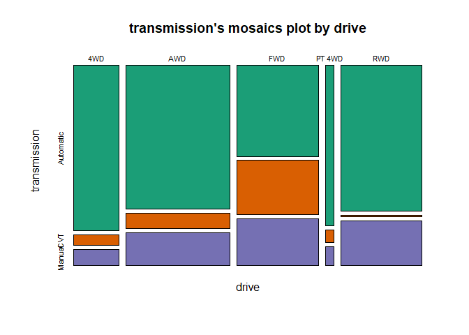

# R Programming

## Set Chunk requirements


```r
knitr::opts_chunk$set(echo = TRUE, message = FALSE, warning = FALSE)
#echo=FALSE indicates that the code will not be shown in the final document 
#(though any results/output would still be displayed).
#include=FALSE to have the chunk evaluated, but neither the code nor its output displayed
# warning=FALSE and message=FALSE suppress any R warnings or messages from being included 
#in the final document
```


## Load Relevant Packages and Data Set


```r
library(tidyverse)
## tidyverse includes readr, ggplot2, dplyr, forcats, tibble, tidyr, purrr, stringr

## Reading our dataset
setwd('E:/Documents/Reinp/GitHub Respositories/ML_Predicting-Vehicle-Fuel-Efficiency')


cars2020 <- read.csv("cars2020.csv")
attach(cars2020)
View(cars2020)
```

## Structure of the Data


```r
#cars2020 #The input data consists of 1,164 observations of 14 variables

head(cars2020)
```

```
##   ï..make          model     mpg transmission gears drive displ cylinders
## 1  Toyota        Corolla 34.2793          CVT    10   FWD   2.0         4
## 2  Toyota Corolla Hybrid 52.0000          CVT     1   FWD   1.8         4
## 3  Toyota        Corolla 31.8162       Manual     6   FWD   2.0         4
## 4  Toyota    Corolla XSE 33.6766          CVT    10   FWD   2.0         4
## 5  Toyota        Corolla 33.0496          CVT     1   FWD   1.8         4
## 6  Toyota        Corolla 33.1228       Manual     6   FWD   1.8         4
##     class lv2 lv4 sidi aspiration        fuelType1 atvType startStop
## 1 Compact   0  13    Y    Natural Regular Gasoline    None         N
## 2 Compact   0  13    N    Natural Regular Gasoline  Hybrid         Y
## 3 Compact   0  13    Y    Natural Regular Gasoline    None         N
## 4 Compact   0  13    Y    Natural Regular Gasoline    None         N
## 5 Compact   0  13    N    Natural Regular Gasoline    None         N
## 6 Compact   0  13    N    Natural Regular Gasoline    None         N
```

```r
tail(cars2020)
```

```
##            ï..make       model     mpg transmission gears drive displ cylinders
## 1159 Mercedes-Benz       S560e 22.8263    Automatic     9   RWD     3         6
## 1160           BMW M2 CS Coupe 19.5165       Manual     6   RWD     3         6
## 1161           BMW M2 CS Coupe 18.7179       Manual     7   RWD     3         6
## 1162          Audi         SQ7 17.1357    Automatic     8   AWD     4         8
## 1163          Audi         SQ8 17.0474    Automatic     8   AWD     4         8
## 1164       Bentley    Bentayga 18.7319    Automatic     8   AWD     3         6
##           class lv2 lv4 sidi aspiration        fuelType1        atvType
## 1159      Large   0   9    Y      Turbo Premium Gasoline Plug-in Hybrid
## 1160 Subcompact  10   0    Y      Turbo Premium Gasoline           None
## 1161 Subcompact  10   0    Y      Turbo Premium Gasoline           None
## 1162    Std SUV   0   0    Y      Turbo Premium Gasoline           None
## 1163    Std SUV   0   0    Y      Turbo Premium Gasoline           None
## 1164    Std SUV   0   0    Y      Turbo Premium Gasoline Plug-in Hybrid
##      startStop
## 1159         Y
## 1160         Y
## 1161         Y
## 1162         Y
## 1163         Y
## 1164         Y
```

```r
# How many variables and observations are there?
ncol(cars2020)
```

```
## [1] 16
```

```r
nrow(cars2020)
```

```
## [1] 1164
```

```r
#learn more about the dataset
help(cars2020)
```

```
## No documentation for 'cars2020' in specified packages and libraries:
## you could try '??cars2020'
```

```r
??cars2020
str(cars2020)
```

```
## 'data.frame':	1164 obs. of  16 variables:
##  $ ï..make     : chr  "Toyota" "Toyota" "Toyota" "Toyota" ...
##  $ model       : chr  "Corolla" "Corolla Hybrid" "Corolla" "Corolla XSE" ...
##  $ mpg         : num  34.3 52 31.8 33.7 33 ...
##  $ transmission: chr  "CVT" "CVT" "Manual" "CVT" ...
##  $ gears       : int  10 1 6 10 1 6 1 1 1 6 ...
##  $ drive       : chr  "FWD" "FWD" "FWD" "FWD" ...
##  $ displ       : num  2 1.8 2 2 1.8 1.8 1.8 2 2 2 ...
##  $ cylinders   : int  4 4 4 4 4 4 4 4 4 4 ...
##  $ class       : chr  "Compact" "Compact" "Compact" "Compact" ...
##  $ lv2         : int  0 0 0 0 0 0 0 0 0 0 ...
##  $ lv4         : int  13 13 13 13 13 13 13 24 24 24 ...
##  $ sidi        : chr  "Y" "N" "Y" "Y" ...
##  $ aspiration  : chr  "Natural" "Natural" "Natural" "Natural" ...
##  $ fuelType1   : chr  "Regular Gasoline" "Regular Gasoline" "Regular Gasoline" "Regular Gasoline" ...
##  $ atvType     : chr  "None" "Hybrid" "None" "None" ...
##  $ startStop   : chr  "N" "Y" "N" "N" ...
```

```r
class(cars2020)
```

```
## [1] "data.frame"
```

```r
typeof(cars2020) 
```

```
## [1] "list"
```

```r
length(cars2020)
```

```
## [1] 16
```

```r
names(cars2020) #display variable names
```

```
##  [1] "ï..make"      "model"        "mpg"          "transmission" "gears"       
##  [6] "drive"        "displ"        "cylinders"    "class"        "lv2"         
## [11] "lv4"          "sidi"         "aspiration"   "fuelType1"    "atvType"     
## [16] "startStop"
```

```r
#attributes(cars2020) #names(cars2020), class(cars2020), row.names(cars2020)
```

## Missing data


```r
which(!complete.cases(cars2020))
```

```
## integer(0)
```

## Descriptive Statistics


```r
library(knitr)
library(mosaic)
library(psych)


names(cars2020)[1] <- "car_make" #rename by index column name with base r functions
#names(cars2020)[names(cars2020) == "ï..make"] <- "car_make"

#summary statistics
summary(cars2020) ##summarizes the dataset
```

```
##    car_make            model                mpg        transmission      
##  Length:1164        Length:1164        Min.   :10.59   Length:1164       
##  Class :character   Class :character   1st Qu.:19.32   Class :character  
##  Mode  :character   Mode  :character   Median :22.63   Mode  :character  
##                                        Mean   :23.55                     
##                                        3rd Qu.:26.36                     
##                                        Max.   :57.78                     
##      gears           drive               displ         cylinders    
##  Min.   : 1.000   Length:1164        Min.   :1.000   Min.   : 3.00  
##  1st Qu.: 6.000   Class :character   1st Qu.:2.000   1st Qu.: 4.00  
##  Median : 8.000   Mode  :character   Median :3.000   Median : 6.00  
##  Mean   : 7.303                      Mean   :3.077   Mean   : 5.57  
##  3rd Qu.: 8.000                      3rd Qu.:3.600   3rd Qu.: 6.00  
##  Max.   :10.000                      Max.   :8.000   Max.   :16.00  
##     class                lv2              lv4             sidi          
##  Length:1164        Min.   : 0.000   Min.   : 0.000   Length:1164       
##  Class :character   1st Qu.: 0.000   1st Qu.: 0.000   Class :character  
##  Mode  :character   Median : 0.000   Median : 0.000   Mode  :character  
##                     Mean   : 1.587   Mean   : 5.253                     
##                     3rd Qu.: 0.000   3rd Qu.:13.000                     
##                     Max.   :22.000   Max.   :47.000                     
##   aspiration         fuelType1           atvType           startStop        
##  Length:1164        Length:1164        Length:1164        Length:1164       
##  Class :character   Class :character   Class :character   Class :character  
##  Mode  :character   Mode  :character   Mode  :character   Mode  :character  
##                                                                             
##                                                                             
## 
```

```r
#1. Dolar sign Syntax

table(cars2020$car_make) 
```

```
## 
##             Acura        Alfa Romeo      Aston Martin              Audi 
##                18                 7                 4                40 
##           Bentley               BMW           Bugatti             Buick 
##                 8               111                 1                14 
##          Cadillac         Chevrolet          Chrysler             Dodge 
##                24                79                 6                25 
##           Ferrari              Fiat              Ford           Genesis 
##                 7                 4                73                15 
##               GMC             Honda           Hyundai          Infiniti 
##                53                45                39                14 
##            Jaguar              Jeep             Karma               Kia 
##                29                36                 1                37 
##       Lamborghini        Land Rover             Lexus           Lincoln 
##                 7                23                37                23 
##             Lotus          Maserati             Mazda     Mercedes-Benz 
##                 4                10                23                89 
##              MINI        Mitsubishi            Nissan           Porsche 
##                17                16                30                40 
##               Ram       Rolls-Royce Roush Performance            Subaru 
##                14                 8                 4                24 
##            Toyota        Volkswagen             Volvo 
##                64                20                21
```

```r
table(cars2020$transmission)
```

```
## 
## Automatic       CVT    Manual 
##       812       128       224
```

```r
table(cars2020$drive)
```

```
## 
##    4WD    AWD    FWD PT 4WD    RWD 
##    164    378    298     30    294
```

```r
table(cars2020$class)
```

```
## 
##          Compact            Large     Mid St Wagon          Midsize 
##              129              103               11              171 
##      Minicompact          Minivan    Passenger Van  Sm Pickup Truck 
##               32                8                2               21 
##      Sm St Wagon           Sm SUV              SPV Std Pickup Truck 
##               30              237               24               87 
##          Std SUV       Subcompact       Two Seater 
##              139              118               52
```

```r
table(cars2020$sidi)
```

```
## 
##   N   Y 
## 217 947
```

```r
table(cars2020$aspiration)
```

```
## 
##     Natural       Super Super+Turbo       Turbo 
##         494          41           6         623
```

```r
table(cars2020$fuelType1)
```

```
## 
##            Diesel Midgrade Gasoline  Premium Gasoline  Regular Gasoline 
##                20                12               593               539
```

```r
table(cars2020$atvType)
```

```
## 
##         Diesel            FFV         Hybrid           None Plug-in Hybrid 
##             20             24             78           1006             36
```

```r
table(cars2020$startStop)
```

```
## 
##   N   Y 
## 492 672
```

```r
summary(cars2020$mpg)
```

```
##    Min. 1st Qu.  Median    Mean 3rd Qu.    Max. 
##   10.59   19.32   22.63   23.55   26.36   57.78
```

```r
summary(cars2020$gears)
```

```
##    Min. 1st Qu.  Median    Mean 3rd Qu.    Max. 
##   1.000   6.000   8.000   7.303   8.000  10.000
```

```r
summary(cars2020$displ)
```

```
##    Min. 1st Qu.  Median    Mean 3rd Qu.    Max. 
##   1.000   2.000   3.000   3.077   3.600   8.000
```

```r
summary(cars2020$cylinders)
```

```
##    Min. 1st Qu.  Median    Mean 3rd Qu.    Max. 
##    3.00    4.00    6.00    5.57    6.00   16.00
```

```r
#2. FormulaSyntax

## one categorical

tally(~car_make, data=cars2020)
```

```
## car_make
##             Acura        Alfa Romeo      Aston Martin              Audi 
##                18                 7                 4                40 
##           Bentley               BMW           Bugatti             Buick 
##                 8               111                 1                14 
##          Cadillac         Chevrolet          Chrysler             Dodge 
##                24                79                 6                25 
##           Ferrari              Fiat              Ford           Genesis 
##                 7                 4                73                15 
##               GMC             Honda           Hyundai          Infiniti 
##                53                45                39                14 
##            Jaguar              Jeep             Karma               Kia 
##                29                36                 1                37 
##       Lamborghini        Land Rover             Lexus           Lincoln 
##                 7                23                37                23 
##             Lotus          Maserati             Mazda     Mercedes-Benz 
##                 4                10                23                89 
##              MINI        Mitsubishi            Nissan           Porsche 
##                17                16                30                40 
##               Ram       Rolls-Royce Roush Performance            Subaru 
##                14                 8                 4                24 
##            Toyota        Volkswagen             Volvo 
##                64                20                21
```

```r
tally(~transmission, data=cars2020)
```

```
## transmission
## Automatic       CVT    Manual 
##       812       128       224
```

```r
tally(~drive, data=cars2020)
```

```
## drive
##    4WD    AWD    FWD PT 4WD    RWD 
##    164    378    298     30    294
```

```r
tally(~class, data=cars2020)
```

```
## class
##          Compact            Large     Mid St Wagon          Midsize 
##              129              103               11              171 
##      Minicompact          Minivan    Passenger Van  Sm Pickup Truck 
##               32                8                2               21 
##      Sm St Wagon           Sm SUV              SPV Std Pickup Truck 
##               30              237               24               87 
##          Std SUV       Subcompact       Two Seater 
##              139              118               52
```

```r
tally(~sidi, data=cars2020)
```

```
## sidi
##   N   Y 
## 217 947
```

```r
tally(~aspiration, data=cars2020)
```

```
## aspiration
##     Natural       Super Super+Turbo       Turbo 
##         494          41           6         623
```

```r
tally(~fuelType1, data=cars2020)
```

```
## fuelType1
##            Diesel Midgrade Gasoline  Premium Gasoline  Regular Gasoline 
##                20                12               593               539
```

```r
tally(~atvType, data=cars2020)
```

```
## atvType
##         Diesel            FFV         Hybrid           None Plug-in Hybrid 
##             20             24             78           1006             36
```

```r
tally(~startStop, data=cars2020)
```

```
## startStop
##   N   Y 
## 492 672
```

```r
## Two categoraical

tally(car_make~transmission, data=cars2020)
```

```
##                    transmission
## car_make            Automatic CVT Manual
##   Acura                    12   0      6
##   Alfa Romeo                6   0      1
##   Aston Martin              4   0      0
##   Audi                     18   0     22
##   Bentley                   3   0      5
##   BMW                      91   0     20
##   Bugatti                   0   0      1
##   Buick                    12   2      0
##   Cadillac                 24   0      0
##   Chevrolet                70   3      6
##   Chrysler                  5   1      0
##   Dodge                    20   0      5
##   Ferrari                   0   0      7
##   Fiat                      3   0      1
##   Ford                     58   6      9
##   Genesis                  14   0      1
##   GMC                      53   0      0
##   Honda                    11  25      9
##   Hyundai                  17   4     18
##   Infiniti                 10   4      0
##   Jaguar                   29   0      0
##   Jeep                     31   0      5
##   Karma                     1   0      0
##   Kia                      20   5     12
##   Lamborghini               1   0      6
##   Land Rover               23   0      0
##   Lexus                    27  10      0
##   Lincoln                  22   1      0
##   Lotus                     2   0      2
##   Maserati                 10   0      0
##   Mazda                    20   0      3
##   Mercedes-Benz            75   0     14
##   MINI                      8   0      9
##   Mitsubishi                2  12      2
##   Nissan                    7  20      3
##   Porsche                   6   0     34
##   Ram                      14   0      0
##   Rolls-Royce               8   0      0
##   Roush Performance         3   0      1
##   Subaru                    1  14      9
##   Toyota                   36  21      7
##   Volkswagen               14   0      6
##   Volvo                    21   0      0
```

```r
tally(car_make~drive, data=cars2020)
```

```
##                    drive
## car_make            4WD AWD FWD PT 4WD RWD
##   Acura               0   9   9      0   0
##   Alfa Romeo          0   3   0      0   4
##   Aston Martin        0   0   0      0   4
##   Audi                0  38   2      0   0
##   Bentley             0   8   0      0   0
##   BMW                 0  65   2      0  44
##   Bugatti             0   1   0      0   0
##   Buick               0   8   6      0   0
##   Cadillac            1  12   4      0   7
##   Chevrolet          28   6  17      0  28
##   Chrysler            0   1   3      0   2
##   Dodge               0   5   2      0  18
##   Ferrari             0   0   0      1   6
##   Fiat                0   1   1      0   2
##   Ford                0   8  18     16  31
##   Genesis             0   7   0      0   8
##   GMC                25   4   5      0  19
##   Honda               2   6  37      0   0
##   Hyundai             0   7  32      0   0
##   Infiniti            1   6   2      0   5
##   Jaguar              0  19   0      0  10
##   Jeep               12  16   7      0   1
##   Karma               0   0   0      0   1
##   Kia                 0   8  27      0   2
##   Lamborghini         0   5   0      0   2
##   Land Rover         14   9   0      0   0
##   Lexus               2  15   8      0  12
##   Lincoln             0  10   7      3   3
##   Lotus               0   0   0      0   4
##   Maserati            0   6   0      0   4
##   Mazda               8   0  13      0   2
##   Mercedes-Benz      48   0   4      0  37
##   MINI                0   6  11      0   0
##   Mitsubishi          6   1   9      0   0
##   Nissan              3   6  14      2   5
##   Porsche             6  27   0      0   7
##   Ram                 6   0   1      0   7
##   Rolls-Royce         0   2   0      0   6
##   Roush Performance   1   0   0      0   3
##   Subaru              0  21   0      0   3
##   Toyota              1  12  36      8   7
##   Volkswagen          0   5  15      0   0
##   Volvo               0  15   6      0   0
```

```r
tally(car_make~class, data=cars2020)
```

```
##                    class
## car_make            Compact Large Mid St Wagon Midsize Minicompact Minivan
##   Acura                   7     0            0       2           0       0
##   Alfa Romeo              0     0            0       3           0       0
##   Aston Martin            0     0            0       0           3       0
##   Audi                    3     4            0       8           0       0
##   Bentley                 0     0            0       1           2       0
##   BMW                    24     8            0      15           0       0
##   Bugatti                 0     0            0       0           0       0
##   Buick                   0     0            0       3           0       0
##   Cadillac                6     2            0       6           0       0
##   Chevrolet               1     2            0       2           0       0
##   Chrysler                0     3            0       0           0       3
##   Dodge                   0     6            0      12           0       1
##   Ferrari                 0     0            0       0           3       0
##   Fiat                    0     0            0       0           0       0
##   Ford                    0     0            0       8           0       0
##   Genesis                 5    10            0       0           0       0
##   GMC                     0     0            0       0           0       0
##   Honda                   6    10            0      10           0       1
##   Hyundai                 7    10            0       8           0       0
##   Infiniti                0     0            0       4           0       0
##   Jaguar                  4     0            2       5           0       0
##   Jeep                    0     0            0       0           0       0
##   Karma                   0     0            0       0           0       0
##   Kia                     1     6            0      11           0       1
##   Lamborghini             0     0            0       0           0       0
##   Land Rover              0     0            0       0           0       0
##   Lexus                   7     0            0      11           0       0
##   Lincoln                 0     6            0       5           0       0
##   Lotus                   0     0            0       0           4       0
##   Maserati                0     3            0       3           0       0
##   Mazda                   7     0            0       5           0       0
##   Mercedes-Benz          16     9            2       5           0       0
##   MINI                    0     0            0       9           3       0
##   Mitsubishi              4     0            0       0           0       0
##   Nissan                  2     0            2       9           0       0
##   Porsche                 0    18            0       0          12       0
##   Ram                     0     0            0       0           0       0
##   Rolls-Royce             1     4            2       1           0       0
##   Roush Performance       0     0            0       0           0       0
##   Subaru                  3     2            0       4           3       0
##   Toyota                 14     0            0      18           2       2
##   Volkswagen              8     0            0       1           0       0
##   Volvo                   3     0            3       2           0       0
##                    class
## car_make            Passenger Van Sm Pickup Truck Sm St Wagon Sm SUV SPV
##   Acura                         0               0           0      8   0
##   Alfa Romeo                    0               0           0      3   0
##   Aston Martin                  0               0           0      0   0
##   Audi                          0               0           1      4   0
##   Bentley                       0               0           0      0   0
##   BMW                           0               0           0     10   0
##   Bugatti                       0               0           0      0   0
##   Buick                         0               0           1      8   0
##   Cadillac                      0               0           0      8   0
##   Chevrolet                     0               8           1     11   4
##   Chrysler                      0               0           0      0   0
##   Dodge                         0               0           0      1   0
##   Ferrari                       0               0           0      0   0
##   Fiat                          0               0           1      1   0
##   Ford                          2               0           0     11   8
##   Genesis                       0               0           0      0   0
##   GMC                           0               6           0      4   4
##   Honda                         0               1           7      9   0
##   Hyundai                       0               0           0     12   0
##   Infiniti                      0               0           0      4   0
##   Jaguar                        0               0           0      6   0
##   Jeep                          0               0           0     29   0
##   Karma                         0               0           0      0   0
##   Kia                           0               0           8     10   0
##   Lamborghini                   0               0           0      0   0
##   Land Rover                    0               0           0      9   0
##   Lexus                         0               0           0      8   0
##   Lincoln                       0               0           0      6   0
##   Lotus                         0               0           0      0   0
##   Maserati                      0               0           0      0   0
##   Mazda                         0               0           0      9   0
##   Mercedes-Benz                 0               0           0     14   6
##   MINI                          0               0           0      0   0
##   Mitsubishi                    0               0           0     12   0
##   Nissan                        0               0           2      5   1
##   Porsche                       0               0           0      4   0
##   Ram                           0               0           0      0   1
##   Rolls-Royce                   0               0           0      0   0
##   Roush Performance             0               0           0      0   0
##   Subaru                        0               0           4      6   0
##   Toyota                        0               6           0     11   0
##   Volkswagen                    0               0           2      8   0
##   Volvo                         0               0           3      6   0
##                    class
## car_make            Std Pickup Truck Std SUV Subcompact Two Seater
##   Acura                            0       0          0          1
##   Alfa Romeo                       0       0          0          1
##   Aston Martin                     0       0          0          1
##   Audi                             0       5         12          3
##   Bentley                          0       3          2          0
##   BMW                              0      14         37          3
##   Bugatti                          0       0          0          1
##   Buick                            0       2          0          0
##   Cadillac                         0       2          0          0
##   Chevrolet                       23      14         12          1
##   Chrysler                         0       0          0          0
##   Dodge                            0       5          0          0
##   Ferrari                          0       0          0          4
##   Fiat                             0       0          0          2
##   Ford                            19      10         14          1
##   Genesis                          0       0          0          0
##   GMC                             22      17          0          0
##   Honda                            1       0          0          0
##   Hyundai                          0       2          0          0
##   Infiniti                         0       2          4          0
##   Jaguar                           0       0          0         12
##   Jeep                             2       5          0          0
##   Karma                            0       0          1          0
##   Kia                              0       0          0          0
##   Lamborghini                      0       1          0          6
##   Land Rover                       0      14          0          0
##   Lexus                            0       4          7          0
##   Lincoln                          0       6          0          0
##   Lotus                            0       0          0          0
##   Maserati                         0       4          0          0
##   Mazda                            0       0          0          2
##   Mercedes-Benz                    0       6         21         10
##   MINI                             0       0          5          0
##   Mitsubishi                       0       0          0          0
##   Nissan                           3       2          1          3
##   Porsche                          0       6          0          0
##   Ram                             13       0          0          0
##   Rolls-Royce                      0       0          0          0
##   Roush Performance                2       0          2          0
##   Subaru                           0       2          0          0
##   Toyota                           2       8          0          1
##   Volkswagen                       0       1          0          0
##   Volvo                            0       4          0          0
```

```r
tally(car_make~sidi, data=cars2020)
```

```
##                    sidi
## car_make              N   Y
##   Acura               1  17
##   Alfa Romeo          0   7
##   Aston Martin        4   0
##   Audi                0  40
##   Bentley             0   8
##   BMW                 0 111
##   Bugatti             1   0
##   Buick               2  12
##   Cadillac            0  24
##   Chevrolet          13  66
##   Chrysler            6   0
##   Dodge              25   0
##   Ferrari             0   7
##   Fiat                3   1
##   Ford               22  51
##   Genesis             0  15
##   GMC                 5  48
##   Honda              15  30
##   Hyundai             9  30
##   Infiniti            0  14
##   Jaguar              0  29
##   Jeep               25  11
##   Karma               0   1
##   Kia                 7  30
##   Lamborghini         2   5
##   Land Rover          3  20
##   Lexus               3  34
##   Lincoln             3  20
##   Lotus               4   0
##   Maserati            0  10
##   Mazda               0  23
##   Mercedes-Benz       2  87
##   MINI                0  17
##   Mitsubishi         12   4
##   Nissan             13  17
##   Porsche             0  40
##   Ram                14   0
##   Rolls-Royce         0   8
##   Roush Performance   2   2
##   Subaru              1  23
##   Toyota             20  44
##   Volkswagen          0  20
##   Volvo               0  21
```

```r
tally(car_make~aspiration, data=cars2020)
```

```
##                    aspiration
## car_make            Natural Super Super+Turbo Turbo
##   Acura                  13     0           0     5
##   Alfa Romeo              0     0           0     7
##   Aston Martin            0     0           0     4
##   Audi                    2     0           0    38
##   Bentley                 0     0           0     8
##   BMW                     0     0           0   111
##   Bugatti                 0     0           0     1
##   Buick                   5     0           0     9
##   Cadillac                7     0           0    17
##   Chevrolet              54     2           0    23
##   Chrysler                6     0           0     0
##   Dodge                  20     5           0     0
##   Ferrari                 2     0           0     5
##   Fiat                    0     0           0     4
##   Ford                   31     1           0    41
##   Genesis                 6     0           0     9
##   GMC                    38     0           0    15
##   Honda                  27     0           0    18
##   Hyundai                27     0           0    12
##   Infiniti                4     0           0    10
##   Jaguar                  0    14           0    15
##   Jeep                   23     1           0    12
##   Karma                   0     0           0     1
##   Kia                    25     0           0    12
##   Lamborghini             6     0           0     1
##   Land Rover              0    10           0    13
##   Lexus                  30     0           0     7
##   Lincoln                 3     0           0    20
##   Lotus                   0     4           0     0
##   Maserati                0     0           0    10
##   Mazda                  19     0           0     4
##   Mercedes-Benz           5     0           0    84
##   MINI                    0     0           0    17
##   Mitsubishi             12     0           0     4
##   Nissan                 28     0           0     2
##   Porsche                 0     0           0    40
##   Ram                    12     0           0     2
##   Rolls-Royce             0     0           0     8
##   Roush Performance       0     4           0     0
##   Subaru                 17     0           0     7
##   Toyota                 63     0           0     1
##   Volkswagen              4     0           0    16
##   Volvo                   5     0           6    10
```

```r
tally(car_make~fuelType1, data=cars2020)
```

```
##                    fuelType1
## car_make            Diesel Midgrade Gasoline Premium Gasoline Regular Gasoline
##   Acura                  0                 0               18                0
##   Alfa Romeo             0                 0                7                0
##   Aston Martin           0                 0                4                0
##   Audi                   0                 0               34                6
##   Bentley                0                 0                8                0
##   BMW                    0                 0              111                0
##   Bugatti                0                 0                1                0
##   Buick                  0                 0                4               10
##   Cadillac               0                 0               19                5
##   Chevrolet              5                 0               17               57
##   Chrysler               0                 1                0                5
##   Dodge                  0                 4               13                8
##   Ferrari                0                 0                7                0
##   Fiat                   0                 0                3                1
##   Ford                   4                 0                3               66
##   Genesis                0                 0               13                2
##   GMC                    5                 0                8               40
##   Honda                  0                 0                5               40
##   Hyundai                0                 0                0               39
##   Infiniti               0                 0               14                0
##   Jaguar                 0                 0               29                0
##   Jeep                   1                 1                2               32
##   Karma                  0                 0                1                0
##   Kia                    0                 0                5               32
##   Lamborghini            0                 0                7                0
##   Land Rover             3                 0               20                0
##   Lexus                  0                 0               26               11
##   Lincoln                0                 0                0               23
##   Lotus                  0                 0                4                0
##   Maserati               0                 0               10                0
##   Mazda                  0                 0                2               21
##   Mercedes-Benz          0                 0               89                0
##   MINI                   0                 0               17                0
##   Mitsubishi             0                 0                1               15
##   Nissan                 0                 0                8               22
##   Porsche                0                 0               40                0
##   Ram                    2                 6                0                6
##   Rolls-Royce            0                 0                8                0
##   Roush Performance      0                 0                4                0
##   Subaru                 0                 0                6               18
##   Toyota                 0                 0                3               61
##   Volkswagen             0                 0                2               18
##   Volvo                  0                 0               20                1
```

```r
tally(car_make~startStop, data=cars2020)
```

```
##                    startStop
## car_make              N   Y
##   Acura               9   9
##   Alfa Romeo          1   6
##   Aston Martin        4   0
##   Audi                4  36
##   Bentley             0   8
##   BMW                 0 111
##   Bugatti             1   0
##   Buick               5   9
##   Cadillac            2  22
##   Chevrolet          49  30
##   Chrysler            3   3
##   Dodge              23   2
##   Ferrari             0   7
##   Fiat                3   1
##   Ford               23  50
##   Genesis            13   2
##   GMC                27  26
##   Honda              38   7
##   Hyundai            29  10
##   Infiniti           14   0
##   Jaguar              0  29
##   Jeep                7  29
##   Karma               0   1
##   Kia                26  11
##   Lamborghini         4   3
##   Land Rover          0  23
##   Lexus              28   9
##   Lincoln            10  13
##   Lotus               4   0
##   Maserati            0  10
##   Mazda              23   0
##   Mercedes-Benz       3  86
##   MINI                7  10
##   Mitsubishi         15   1
##   Nissan             30   0
##   Porsche             0  40
##   Ram                 8   6
##   Rolls-Royce         8   0
##   Roush Performance   4   0
##   Subaru             19   5
##   Toyota             44  20
##   Volkswagen          4  16
##   Volvo               0  21
```

```r
library(kableExtra)
kable(cbind(tally(car_make~transmission, data=cars2020), tally(car_make~sidi,
 data=cars2020), tally(car_make~startStop, data=cars2020)), align = "cccrrrr", 
  caption = "Group Rows")%>%
  add_header_above(c(" ", "Transmission" = 3, "Spark Ignited Direct Ignition" = 2,
                     "start-stop technology" = 2))
```

<table>
<caption>Group Rows</caption>
 <thead>
<tr>
<th style="border-bottom:hidden" colspan="1"></th>
<th style="border-bottom:hidden; padding-bottom:0; padding-left:3px;padding-right:3px;text-align: center; " colspan="3"><div style="border-bottom: 1px solid #ddd; padding-bottom: 5px; ">Transmission</div></th>
<th style="border-bottom:hidden; padding-bottom:0; padding-left:3px;padding-right:3px;text-align: center; " colspan="2"><div style="border-bottom: 1px solid #ddd; padding-bottom: 5px; ">Spark Ignited Direct Ignition</div></th>
<th style="border-bottom:hidden; padding-bottom:0; padding-left:3px;padding-right:3px;text-align: center; " colspan="2"><div style="border-bottom: 1px solid #ddd; padding-bottom: 5px; ">start-stop technology</div></th>
</tr>
  <tr>
   <th style="text-align:left;">   </th>
   <th style="text-align:center;"> Automatic </th>
   <th style="text-align:center;"> CVT </th>
   <th style="text-align:center;"> Manual </th>
   <th style="text-align:right;"> N </th>
   <th style="text-align:right;"> Y </th>
   <th style="text-align:right;"> N </th>
   <th style="text-align:right;"> Y </th>
  </tr>
 </thead>
<tbody>
  <tr>
   <td style="text-align:left;"> Acura </td>
   <td style="text-align:center;"> 12 </td>
   <td style="text-align:center;"> 0 </td>
   <td style="text-align:center;"> 6 </td>
   <td style="text-align:right;"> 1 </td>
   <td style="text-align:right;"> 17 </td>
   <td style="text-align:right;"> 9 </td>
   <td style="text-align:right;"> 9 </td>
  </tr>
  <tr>
   <td style="text-align:left;"> Alfa Romeo </td>
   <td style="text-align:center;"> 6 </td>
   <td style="text-align:center;"> 0 </td>
   <td style="text-align:center;"> 1 </td>
   <td style="text-align:right;"> 0 </td>
   <td style="text-align:right;"> 7 </td>
   <td style="text-align:right;"> 1 </td>
   <td style="text-align:right;"> 6 </td>
  </tr>
  <tr>
   <td style="text-align:left;"> Aston Martin </td>
   <td style="text-align:center;"> 4 </td>
   <td style="text-align:center;"> 0 </td>
   <td style="text-align:center;"> 0 </td>
   <td style="text-align:right;"> 4 </td>
   <td style="text-align:right;"> 0 </td>
   <td style="text-align:right;"> 4 </td>
   <td style="text-align:right;"> 0 </td>
  </tr>
  <tr>
   <td style="text-align:left;"> Audi </td>
   <td style="text-align:center;"> 18 </td>
   <td style="text-align:center;"> 0 </td>
   <td style="text-align:center;"> 22 </td>
   <td style="text-align:right;"> 0 </td>
   <td style="text-align:right;"> 40 </td>
   <td style="text-align:right;"> 4 </td>
   <td style="text-align:right;"> 36 </td>
  </tr>
  <tr>
   <td style="text-align:left;"> Bentley </td>
   <td style="text-align:center;"> 3 </td>
   <td style="text-align:center;"> 0 </td>
   <td style="text-align:center;"> 5 </td>
   <td style="text-align:right;"> 0 </td>
   <td style="text-align:right;"> 8 </td>
   <td style="text-align:right;"> 0 </td>
   <td style="text-align:right;"> 8 </td>
  </tr>
  <tr>
   <td style="text-align:left;"> BMW </td>
   <td style="text-align:center;"> 91 </td>
   <td style="text-align:center;"> 0 </td>
   <td style="text-align:center;"> 20 </td>
   <td style="text-align:right;"> 0 </td>
   <td style="text-align:right;"> 111 </td>
   <td style="text-align:right;"> 0 </td>
   <td style="text-align:right;"> 111 </td>
  </tr>
  <tr>
   <td style="text-align:left;"> Bugatti </td>
   <td style="text-align:center;"> 0 </td>
   <td style="text-align:center;"> 0 </td>
   <td style="text-align:center;"> 1 </td>
   <td style="text-align:right;"> 1 </td>
   <td style="text-align:right;"> 0 </td>
   <td style="text-align:right;"> 1 </td>
   <td style="text-align:right;"> 0 </td>
  </tr>
  <tr>
   <td style="text-align:left;"> Buick </td>
   <td style="text-align:center;"> 12 </td>
   <td style="text-align:center;"> 2 </td>
   <td style="text-align:center;"> 0 </td>
   <td style="text-align:right;"> 2 </td>
   <td style="text-align:right;"> 12 </td>
   <td style="text-align:right;"> 5 </td>
   <td style="text-align:right;"> 9 </td>
  </tr>
  <tr>
   <td style="text-align:left;"> Cadillac </td>
   <td style="text-align:center;"> 24 </td>
   <td style="text-align:center;"> 0 </td>
   <td style="text-align:center;"> 0 </td>
   <td style="text-align:right;"> 0 </td>
   <td style="text-align:right;"> 24 </td>
   <td style="text-align:right;"> 2 </td>
   <td style="text-align:right;"> 22 </td>
  </tr>
  <tr>
   <td style="text-align:left;"> Chevrolet </td>
   <td style="text-align:center;"> 70 </td>
   <td style="text-align:center;"> 3 </td>
   <td style="text-align:center;"> 6 </td>
   <td style="text-align:right;"> 13 </td>
   <td style="text-align:right;"> 66 </td>
   <td style="text-align:right;"> 49 </td>
   <td style="text-align:right;"> 30 </td>
  </tr>
  <tr>
   <td style="text-align:left;"> Chrysler </td>
   <td style="text-align:center;"> 5 </td>
   <td style="text-align:center;"> 1 </td>
   <td style="text-align:center;"> 0 </td>
   <td style="text-align:right;"> 6 </td>
   <td style="text-align:right;"> 0 </td>
   <td style="text-align:right;"> 3 </td>
   <td style="text-align:right;"> 3 </td>
  </tr>
  <tr>
   <td style="text-align:left;"> Dodge </td>
   <td style="text-align:center;"> 20 </td>
   <td style="text-align:center;"> 0 </td>
   <td style="text-align:center;"> 5 </td>
   <td style="text-align:right;"> 25 </td>
   <td style="text-align:right;"> 0 </td>
   <td style="text-align:right;"> 23 </td>
   <td style="text-align:right;"> 2 </td>
  </tr>
  <tr>
   <td style="text-align:left;"> Ferrari </td>
   <td style="text-align:center;"> 0 </td>
   <td style="text-align:center;"> 0 </td>
   <td style="text-align:center;"> 7 </td>
   <td style="text-align:right;"> 0 </td>
   <td style="text-align:right;"> 7 </td>
   <td style="text-align:right;"> 0 </td>
   <td style="text-align:right;"> 7 </td>
  </tr>
  <tr>
   <td style="text-align:left;"> Fiat </td>
   <td style="text-align:center;"> 3 </td>
   <td style="text-align:center;"> 0 </td>
   <td style="text-align:center;"> 1 </td>
   <td style="text-align:right;"> 3 </td>
   <td style="text-align:right;"> 1 </td>
   <td style="text-align:right;"> 3 </td>
   <td style="text-align:right;"> 1 </td>
  </tr>
  <tr>
   <td style="text-align:left;"> Ford </td>
   <td style="text-align:center;"> 58 </td>
   <td style="text-align:center;"> 6 </td>
   <td style="text-align:center;"> 9 </td>
   <td style="text-align:right;"> 22 </td>
   <td style="text-align:right;"> 51 </td>
   <td style="text-align:right;"> 23 </td>
   <td style="text-align:right;"> 50 </td>
  </tr>
  <tr>
   <td style="text-align:left;"> Genesis </td>
   <td style="text-align:center;"> 14 </td>
   <td style="text-align:center;"> 0 </td>
   <td style="text-align:center;"> 1 </td>
   <td style="text-align:right;"> 0 </td>
   <td style="text-align:right;"> 15 </td>
   <td style="text-align:right;"> 13 </td>
   <td style="text-align:right;"> 2 </td>
  </tr>
  <tr>
   <td style="text-align:left;"> GMC </td>
   <td style="text-align:center;"> 53 </td>
   <td style="text-align:center;"> 0 </td>
   <td style="text-align:center;"> 0 </td>
   <td style="text-align:right;"> 5 </td>
   <td style="text-align:right;"> 48 </td>
   <td style="text-align:right;"> 27 </td>
   <td style="text-align:right;"> 26 </td>
  </tr>
  <tr>
   <td style="text-align:left;"> Honda </td>
   <td style="text-align:center;"> 11 </td>
   <td style="text-align:center;"> 25 </td>
   <td style="text-align:center;"> 9 </td>
   <td style="text-align:right;"> 15 </td>
   <td style="text-align:right;"> 30 </td>
   <td style="text-align:right;"> 38 </td>
   <td style="text-align:right;"> 7 </td>
  </tr>
  <tr>
   <td style="text-align:left;"> Hyundai </td>
   <td style="text-align:center;"> 17 </td>
   <td style="text-align:center;"> 4 </td>
   <td style="text-align:center;"> 18 </td>
   <td style="text-align:right;"> 9 </td>
   <td style="text-align:right;"> 30 </td>
   <td style="text-align:right;"> 29 </td>
   <td style="text-align:right;"> 10 </td>
  </tr>
  <tr>
   <td style="text-align:left;"> Infiniti </td>
   <td style="text-align:center;"> 10 </td>
   <td style="text-align:center;"> 4 </td>
   <td style="text-align:center;"> 0 </td>
   <td style="text-align:right;"> 0 </td>
   <td style="text-align:right;"> 14 </td>
   <td style="text-align:right;"> 14 </td>
   <td style="text-align:right;"> 0 </td>
  </tr>
  <tr>
   <td style="text-align:left;"> Jaguar </td>
   <td style="text-align:center;"> 29 </td>
   <td style="text-align:center;"> 0 </td>
   <td style="text-align:center;"> 0 </td>
   <td style="text-align:right;"> 0 </td>
   <td style="text-align:right;"> 29 </td>
   <td style="text-align:right;"> 0 </td>
   <td style="text-align:right;"> 29 </td>
  </tr>
  <tr>
   <td style="text-align:left;"> Jeep </td>
   <td style="text-align:center;"> 31 </td>
   <td style="text-align:center;"> 0 </td>
   <td style="text-align:center;"> 5 </td>
   <td style="text-align:right;"> 25 </td>
   <td style="text-align:right;"> 11 </td>
   <td style="text-align:right;"> 7 </td>
   <td style="text-align:right;"> 29 </td>
  </tr>
  <tr>
   <td style="text-align:left;"> Karma </td>
   <td style="text-align:center;"> 1 </td>
   <td style="text-align:center;"> 0 </td>
   <td style="text-align:center;"> 0 </td>
   <td style="text-align:right;"> 0 </td>
   <td style="text-align:right;"> 1 </td>
   <td style="text-align:right;"> 0 </td>
   <td style="text-align:right;"> 1 </td>
  </tr>
  <tr>
   <td style="text-align:left;"> Kia </td>
   <td style="text-align:center;"> 20 </td>
   <td style="text-align:center;"> 5 </td>
   <td style="text-align:center;"> 12 </td>
   <td style="text-align:right;"> 7 </td>
   <td style="text-align:right;"> 30 </td>
   <td style="text-align:right;"> 26 </td>
   <td style="text-align:right;"> 11 </td>
  </tr>
  <tr>
   <td style="text-align:left;"> Lamborghini </td>
   <td style="text-align:center;"> 1 </td>
   <td style="text-align:center;"> 0 </td>
   <td style="text-align:center;"> 6 </td>
   <td style="text-align:right;"> 2 </td>
   <td style="text-align:right;"> 5 </td>
   <td style="text-align:right;"> 4 </td>
   <td style="text-align:right;"> 3 </td>
  </tr>
  <tr>
   <td style="text-align:left;"> Land Rover </td>
   <td style="text-align:center;"> 23 </td>
   <td style="text-align:center;"> 0 </td>
   <td style="text-align:center;"> 0 </td>
   <td style="text-align:right;"> 3 </td>
   <td style="text-align:right;"> 20 </td>
   <td style="text-align:right;"> 0 </td>
   <td style="text-align:right;"> 23 </td>
  </tr>
  <tr>
   <td style="text-align:left;"> Lexus </td>
   <td style="text-align:center;"> 27 </td>
   <td style="text-align:center;"> 10 </td>
   <td style="text-align:center;"> 0 </td>
   <td style="text-align:right;"> 3 </td>
   <td style="text-align:right;"> 34 </td>
   <td style="text-align:right;"> 28 </td>
   <td style="text-align:right;"> 9 </td>
  </tr>
  <tr>
   <td style="text-align:left;"> Lincoln </td>
   <td style="text-align:center;"> 22 </td>
   <td style="text-align:center;"> 1 </td>
   <td style="text-align:center;"> 0 </td>
   <td style="text-align:right;"> 3 </td>
   <td style="text-align:right;"> 20 </td>
   <td style="text-align:right;"> 10 </td>
   <td style="text-align:right;"> 13 </td>
  </tr>
  <tr>
   <td style="text-align:left;"> Lotus </td>
   <td style="text-align:center;"> 2 </td>
   <td style="text-align:center;"> 0 </td>
   <td style="text-align:center;"> 2 </td>
   <td style="text-align:right;"> 4 </td>
   <td style="text-align:right;"> 0 </td>
   <td style="text-align:right;"> 4 </td>
   <td style="text-align:right;"> 0 </td>
  </tr>
  <tr>
   <td style="text-align:left;"> Maserati </td>
   <td style="text-align:center;"> 10 </td>
   <td style="text-align:center;"> 0 </td>
   <td style="text-align:center;"> 0 </td>
   <td style="text-align:right;"> 0 </td>
   <td style="text-align:right;"> 10 </td>
   <td style="text-align:right;"> 0 </td>
   <td style="text-align:right;"> 10 </td>
  </tr>
  <tr>
   <td style="text-align:left;"> Mazda </td>
   <td style="text-align:center;"> 20 </td>
   <td style="text-align:center;"> 0 </td>
   <td style="text-align:center;"> 3 </td>
   <td style="text-align:right;"> 0 </td>
   <td style="text-align:right;"> 23 </td>
   <td style="text-align:right;"> 23 </td>
   <td style="text-align:right;"> 0 </td>
  </tr>
  <tr>
   <td style="text-align:left;"> Mercedes-Benz </td>
   <td style="text-align:center;"> 75 </td>
   <td style="text-align:center;"> 0 </td>
   <td style="text-align:center;"> 14 </td>
   <td style="text-align:right;"> 2 </td>
   <td style="text-align:right;"> 87 </td>
   <td style="text-align:right;"> 3 </td>
   <td style="text-align:right;"> 86 </td>
  </tr>
  <tr>
   <td style="text-align:left;"> MINI </td>
   <td style="text-align:center;"> 8 </td>
   <td style="text-align:center;"> 0 </td>
   <td style="text-align:center;"> 9 </td>
   <td style="text-align:right;"> 0 </td>
   <td style="text-align:right;"> 17 </td>
   <td style="text-align:right;"> 7 </td>
   <td style="text-align:right;"> 10 </td>
  </tr>
  <tr>
   <td style="text-align:left;"> Mitsubishi </td>
   <td style="text-align:center;"> 2 </td>
   <td style="text-align:center;"> 12 </td>
   <td style="text-align:center;"> 2 </td>
   <td style="text-align:right;"> 12 </td>
   <td style="text-align:right;"> 4 </td>
   <td style="text-align:right;"> 15 </td>
   <td style="text-align:right;"> 1 </td>
  </tr>
  <tr>
   <td style="text-align:left;"> Nissan </td>
   <td style="text-align:center;"> 7 </td>
   <td style="text-align:center;"> 20 </td>
   <td style="text-align:center;"> 3 </td>
   <td style="text-align:right;"> 13 </td>
   <td style="text-align:right;"> 17 </td>
   <td style="text-align:right;"> 30 </td>
   <td style="text-align:right;"> 0 </td>
  </tr>
  <tr>
   <td style="text-align:left;"> Porsche </td>
   <td style="text-align:center;"> 6 </td>
   <td style="text-align:center;"> 0 </td>
   <td style="text-align:center;"> 34 </td>
   <td style="text-align:right;"> 0 </td>
   <td style="text-align:right;"> 40 </td>
   <td style="text-align:right;"> 0 </td>
   <td style="text-align:right;"> 40 </td>
  </tr>
  <tr>
   <td style="text-align:left;"> Ram </td>
   <td style="text-align:center;"> 14 </td>
   <td style="text-align:center;"> 0 </td>
   <td style="text-align:center;"> 0 </td>
   <td style="text-align:right;"> 14 </td>
   <td style="text-align:right;"> 0 </td>
   <td style="text-align:right;"> 8 </td>
   <td style="text-align:right;"> 6 </td>
  </tr>
  <tr>
   <td style="text-align:left;"> Rolls-Royce </td>
   <td style="text-align:center;"> 8 </td>
   <td style="text-align:center;"> 0 </td>
   <td style="text-align:center;"> 0 </td>
   <td style="text-align:right;"> 0 </td>
   <td style="text-align:right;"> 8 </td>
   <td style="text-align:right;"> 8 </td>
   <td style="text-align:right;"> 0 </td>
  </tr>
  <tr>
   <td style="text-align:left;"> Roush Performance </td>
   <td style="text-align:center;"> 3 </td>
   <td style="text-align:center;"> 0 </td>
   <td style="text-align:center;"> 1 </td>
   <td style="text-align:right;"> 2 </td>
   <td style="text-align:right;"> 2 </td>
   <td style="text-align:right;"> 4 </td>
   <td style="text-align:right;"> 0 </td>
  </tr>
  <tr>
   <td style="text-align:left;"> Subaru </td>
   <td style="text-align:center;"> 1 </td>
   <td style="text-align:center;"> 14 </td>
   <td style="text-align:center;"> 9 </td>
   <td style="text-align:right;"> 1 </td>
   <td style="text-align:right;"> 23 </td>
   <td style="text-align:right;"> 19 </td>
   <td style="text-align:right;"> 5 </td>
  </tr>
  <tr>
   <td style="text-align:left;"> Toyota </td>
   <td style="text-align:center;"> 36 </td>
   <td style="text-align:center;"> 21 </td>
   <td style="text-align:center;"> 7 </td>
   <td style="text-align:right;"> 20 </td>
   <td style="text-align:right;"> 44 </td>
   <td style="text-align:right;"> 44 </td>
   <td style="text-align:right;"> 20 </td>
  </tr>
  <tr>
   <td style="text-align:left;"> Volkswagen </td>
   <td style="text-align:center;"> 14 </td>
   <td style="text-align:center;"> 0 </td>
   <td style="text-align:center;"> 6 </td>
   <td style="text-align:right;"> 0 </td>
   <td style="text-align:right;"> 20 </td>
   <td style="text-align:right;"> 4 </td>
   <td style="text-align:right;"> 16 </td>
  </tr>
  <tr>
   <td style="text-align:left;"> Volvo </td>
   <td style="text-align:center;"> 21 </td>
   <td style="text-align:center;"> 0 </td>
   <td style="text-align:center;"> 0 </td>
   <td style="text-align:right;"> 0 </td>
   <td style="text-align:right;"> 21 </td>
   <td style="text-align:right;"> 0 </td>
   <td style="text-align:right;"> 21 </td>
  </tr>
</tbody>
</table>

```r
#latex, html, markdown, pandoc, and rst


##one continous variable

favstats(~mpg, data=cars2020)[c("max", "mean","sd", "n")]
```

```
##      max     mean      sd    n
##  57.7824 23.55156 6.40129 1164
```

```r
favstats(~mpg, data=cars2020)
```

```
##      min      Q1  median      Q3     max     mean      sd    n missing
##  10.5921 19.3234 22.6291 26.3573 57.7824 23.55156 6.40129 1164       0
```

```r
favstats(~gears, data=cars2020)
```

```
##  min Q1 median Q3 max     mean       sd    n missing
##    1  6      8  8  10 7.303265 1.972718 1164       0
```

```r
favstats(~displ, data=cars2020)
```

```
##  min Q1 median  Q3 max     mean      sd    n missing
##    1  2      3 3.6   8 3.076546 1.29394 1164       0
```

```r
favstats(~cylinders, data=cars2020)
```

```
##  min Q1 median Q3 max     mean       sd    n missing
##    3  4      6  6  16 5.569588 1.826848 1164       0
```

```r
##one continous one categorical

favstats(mpg~ car_make, data=cars2020)
```

```
##             car_make     min       Q1   median       Q3     max     mean
## 1              Acura 21.0000 22.94900 23.25380 25.75972 28.0000 24.07169
## 2         Alfa Romeo 19.1410 22.36360 25.32660 26.24905 27.9406 24.23336
## 3       Aston Martin 17.0315 17.54953 19.06770 20.41378 20.4155 18.89560
## 4               Audi 15.2575 20.38198 22.65465 25.99520 30.1793 22.71765
## 5            Bentley 13.6613 14.66160 16.16640 18.79032 18.9656 16.49755
## 6                BMW 15.0983 18.81510 22.69820 25.15485 29.6330 22.32187
## 7            Bugatti 10.5921 10.59210 10.59210 10.59210 10.5921 10.59210
## 8              Buick 20.0162 22.45845 24.54265 26.71392 30.7314 24.78502
## 9           Cadillac 16.5637 20.35020 22.20880 24.23393 27.1593 22.17932
## 10         Chevrolet 14.9623 17.00000 19.61160 23.30990 32.9630 20.72874
## 11          Chrysler 19.0620 21.61542 22.24520 22.64615 29.5207 22.87640
## 12             Dodge 15.0483 16.68870 17.76080 20.77540 22.7798 18.36674
## 13           Ferrari 13.3412 14.85070 16.61150 16.90515 18.1715 15.94799
## 14              Fiat 24.9382 25.71632 27.63775 29.39140 29.6662 27.46997
## 15              Ford 14.0853 18.86980 22.85180 24.81560 42.0000 23.24922
## 16           Genesis 17.7991 19.19875 20.09290 20.70120 24.8653 20.26011
## 17               GMC 14.9623 16.94260 18.15210 21.53040 27.4108 19.33331
## 18             Honda 20.5738 25.95250 30.25000 33.23830 51.9827 30.68666
## 19           Hyundai 21.1618 24.89410 29.50960 32.19735 57.7824 31.29421
## 20          Infiniti 15.3391 21.70990 21.97385 22.41270 26.1476 21.62992
## 21            Jaguar 18.1891 20.86350 23.42660 25.66260 28.4037 23.14366
## 22              Jeep 13.3061 20.44058 22.19925 24.75897 26.9515 22.08787
## 23             Karma 25.8000 25.80000 25.80000 25.80000 25.8000 25.80000
## 24               Kia 19.9185 22.95260 27.05040 31.34930 50.4101 28.96986
## 25       Lamborghini 10.7137 12.43430 14.98990 14.99780 15.0057 13.65336
## 26        Land Rover 15.1147 18.09170 20.24570 22.40790 24.3843 20.11077
## 27             Lexus 13.8684 21.00000 22.82060 25.78180 44.0943 24.77066
## 28           Lincoln 17.5802 19.45870 20.98220 23.06780 41.0000 21.87267
## 29             Lotus 18.9178 19.42592 19.71800 19.88577 20.0210 19.59370
## 30          Maserati 15.3607 17.11340 17.75225 19.16457 19.3234 17.71110
## 31             Mazda 22.6002 26.74620 28.32850 29.67095 34.9351 28.36609
## 32     Mercedes-Benz 13.8444 19.69810 21.72890 23.77550 28.4696 21.69211
## 33              MINI 25.8460 27.37610 28.90900 29.79170 31.3799 28.61675
## 34        Mitsubishi 22.0000 25.31330 26.07675 29.26265 38.6074 28.41024
## 35            Nissan 15.0000 20.92748 24.69735 29.75000 35.0880 25.06172
## 36           Porsche 16.5714 19.93535 20.05000 20.98852 22.5030 20.27934
## 37               Ram 16.8732 17.69468 19.36585 22.39708 26.0473 20.31741
## 38       Rolls-Royce 13.8915 13.89150 14.24320 14.32477 14.3910 14.15570
## 39 Roush Performance 12.6756 12.67560 13.45995 14.50355 15.2813 13.71920
## 40            Subaru 18.6117 23.61950 26.33855 29.86630 35.1000 26.60871
## 41            Toyota 14.2639 22.44510 29.04465 34.45507 55.7000 30.08026
## 42        Volkswagen 18.5818 21.28947 24.96860 27.80837 34.0525 25.16221
## 43             Volvo 20.7216 24.41490 25.04910 26.80000 30.3000 25.61402
##            sd   n missing
## 1   2.1752314  18       0
## 2   3.3010997   7       0
## 3   1.7762265   4       0
## 4   3.8987561  40       0
## 5   2.2336328   8       0
## 6   3.8143732 111       0
## 7          NA   1       0
## 8   2.9760769  14       0
## 9   2.9424019  24       0
## 10  4.7512070  79       0
## 11  3.5118677   6       0
## 12  2.4610517  25       0
## 13  1.8588942   7       0
## 14  2.3674463   4       0
## 15  6.3652742  73       0
## 16  1.8665636  15       0
## 17  3.1824577  53       0
## 18  7.0546366  45       0
## 19  9.2785626  39       0
## 20  2.8580110  14       0
## 21  3.1570395  29       0
## 22  3.1179285  36       0
## 23         NA   1       0
## 24  8.5169456  37       0
## 25  1.9721285   7       0
## 26  2.6820479  23       0
## 27  6.4340354  37       0
## 28  4.6757040  23       0
## 29  0.4831969   4       0
## 30  1.5327897  10       0
## 31  2.8371422  23       0
## 32  3.3337919  89       0
## 33  1.8526389  17       0
## 34  5.2112248  16       0
## 35  5.7281523  30       0
## 36  1.3217165  40       0
## 37  2.9959636  14       0
## 38  0.2280787   8       0
## 39  1.2772481   4       0
## 40  3.8769619  24       0
## 41 10.6627305  64       0
## 42  4.9693528  20       0
## 43  2.4995829  21       0
```

```r
favstats(mpg~ transmission, data=cars2020)
```

```
##   transmission     min       Q1   median       Q3     max     mean       sd   n
## 1    Automatic 12.6756 18.74643 21.83710 24.51057 35.0000 21.79283 3.955858 812
## 2          CVT 20.5416 28.21187 31.70975 35.66655 55.7000 33.04857 7.548859 128
## 3       Manual 10.5921 19.26342 23.07110 28.29508 57.7824 24.50010 7.771829 224
##   missing
## 1       0
## 2       0
## 3       0
```

```r
favstats(mpg~ drive, data=cars2020)
```

```
##    drive     min       Q1   median       Q3     max     mean       sd   n
## 1    4WD 12.6756 17.16615 20.03900 22.56383 29.1658 20.21910 3.668326 164
## 2    AWD 10.5921 19.90560 22.39135 24.93400 40.1750 22.36506 4.331883 378
## 3    FWD 14.9383 24.82985 28.40920 32.44302 57.7824 29.81908 7.405999 298
## 4 PT 4WD 13.3849 17.63443 18.83200 21.48560 50.0000 20.77963 7.196986  30
## 5    RWD 12.6756 17.76080 20.22140 23.27003 29.7239 20.86606 3.779483 294
##   missing
## 1       0
## 2       0
## 3       0
## 4       0
## 5       0
```

```r
favstats(mpg~ class, data=cars2020)
```

```
##               class     min       Q1   median       Q3     max     mean
## 1           Compact 13.8915 23.19480 27.01130 30.91110 52.0000 27.49157
## 2             Large 13.8915 19.28750 21.00000 25.06490 57.7824 23.37516
## 3      Mid St Wagon 14.3027 19.68190 22.90020 23.84745 26.0000 21.30856
## 4           Midsize 14.1837 22.58530 26.14910 30.37180 55.7000 27.71872
## 5       Minicompact 13.3849 19.43788 20.00000 21.08908 31.3799 20.92383
## 6           Minivan 19.9421 20.43483 21.79360 22.29650 29.5207 22.30169
## 7     Passenger Van 15.8294 16.02777 16.22615 16.42453 16.6229 16.22615
## 8   Sm Pickup Truck 16.6991 19.41600 20.64570 21.85340 23.3948 20.57527
## 9       Sm St Wagon 23.4414 26.55780 28.81495 30.94125 50.4101 30.88478
## 10           Sm SUV 16.1587 21.99030 23.80190 25.94230 40.5365 24.16257
## 11              SPV 14.9623 16.56610 21.83010 22.79840 25.6715 20.45617
## 12 Std Pickup Truck 12.6756 17.00000 18.63500 20.30245 26.5885 19.04348
## 13          Std SUV 13.3061 16.68870 17.74250 20.93030 35.0205 18.94294
## 14       Subcompact 14.0853 19.70100 22.69175 24.98710 32.9630 22.74225
## 15       Two Seater 10.5921 16.72445 20.12650 23.74470 29.7239 20.30205
##           sd   n missing
## 1  5.9860021 129       0
## 2  7.9158575 103       0
## 3  3.9909745  11       0
## 4  8.3817478 171       0
## 5  3.9945048  32       0
## 6  3.0812029   8       0
## 7  0.5610892   2       0
## 8  1.6946128  21       0
## 9  7.1356223  30       0
## 10 3.7389130 237       0
## 11 3.9407017  24       0
## 12 2.9037640  87       0
## 13 3.7249644 139       0
## 14 4.1334848 118       0
## 15 5.1427132  52       0
```

```r
favstats(mpg~ aspiration, data=cars2020)
```

```
##    aspiration     min       Q1  median       Q3     max     mean       sd   n
## 1     Natural 10.7137 18.66238 22.6291 29.25325 57.7824 24.85538 8.365734 494
## 2       Super 12.6756 15.57740 18.1891 20.02100 22.6919 17.88819 2.823748  41
## 3 Super+Turbo 20.7216 23.05193 24.2162 24.74740 25.0491 23.63190 1.648968   6
## 4       Turbo 10.5921 20.04260 22.9512 25.69235 36.0339 22.88966 4.087568 623
##   missing
## 1       0
## 2       0
## 3       0
## 4       0
```

```r
favstats(mpg~ fuelType1, data=cars2020)
```

```
##           fuelType1     min       Q1  median       Q3     max     mean       sd
## 1            Diesel 19.4160 23.21720 24.0249 24.46850 26.5885 23.82984 1.628788
## 2 Midgrade Gasoline 16.6887 16.91152 17.3101 19.02563 19.0620 17.81245 1.057577
## 3  Premium Gasoline 10.5921 18.48220 21.6894 24.70460 32.0168 21.58884 4.146422
## 4  Regular Gasoline 14.2639 20.54740 24.2002 29.63450 57.7824 25.82837 7.705009
##     n missing
## 1  20       0
## 2  12       0
## 3 593       0
## 4 539       0
```

```r
favstats(mpg~ atvType, data=cars2020)
```

```
##          atvType     min       Q1   median       Q3     max     mean        sd
## 1         Diesel 19.4160 23.21720 24.02490 24.46850 26.5885 23.82984  1.628788
## 2            FFV 15.7301 16.36830 17.56585 18.78630 25.6715 18.31084  2.724908
## 3         Hybrid 15.2575 21.50252 27.79440 42.89655 57.7824 32.35495 12.246403
## 4           None 10.5921 19.21265 22.45000 25.96990 38.6074 22.79603  4.936485
## 5 Plug-in Hybrid 18.7319 22.50300 26.57015 30.30000 54.4329 28.92968  9.372533
##      n missing
## 1   20       0
## 2   24       0
## 3   78       0
## 4 1006       0
## 5   36       0
```

```r
##one continous two categorical

favstats(mpg~ car_make+transmission, data=cars2020)
```

```
##           car_make.transmission     min       Q1   median       Q3     max
## 1               Acura.Automatic 21.3495 22.91180 23.02550 23.39275 24.0000
## 2          Alfa Romeo.Automatic 19.1410 21.33900 24.86970 25.48912 26.9548
## 3        Aston Martin.Automatic 17.0315 17.54953 19.06770 20.41378 20.4155
## 4                Audi.Automatic 15.2575 18.02725 21.05285 22.41137 24.2823
## 5             Bentley.Automatic 13.6613 15.49950 17.33770 18.03480 18.7319
## 6                 BMW.Automatic 15.0983 19.59150 24.38790 25.68145 29.6330
## 7             Bugatti.Automatic      NA       NA       NA       NA      NA
## 8               Buick.Automatic 20.0162 21.96215 24.38220 25.88982 27.5574
## 9            Cadillac.Automatic 16.5637 20.35020 22.20880 24.23393 27.1593
## 10          Chevrolet.Automatic 14.9623 16.96363 19.32325 22.21872 28.8278
## 11           Chrysler.Automatic 19.0620 21.40550 22.24520 22.24520 22.7798
## 12              Dodge.Automatic 15.0483 16.86540 18.41140 21.20870 22.7798
## 13            Ferrari.Automatic      NA       NA       NA       NA      NA
## 14               Fiat.Automatic 24.9382 25.45695 25.97570 27.63775 29.2998
## 15               Ford.Automatic 15.8294 19.00000 22.26840 24.33380 30.2418
## 16            Genesis.Automatic 17.7991 19.00538 20.04385 20.23080 24.8653
## 17                GMC.Automatic 14.9623 16.94260 18.15210 21.53040 27.4108
## 18              Honda.Automatic 20.5738 21.50430 22.05810 22.57630 27.0324
## 19            Hyundai.Automatic 21.1618 23.25740 24.63670 29.74900 31.7911
## 20           Infiniti.Automatic 15.3391 21.19285 21.90640 22.02340 23.0508
## 21             Jaguar.Automatic 18.1891 20.86350 23.42660 25.66260 28.4037
## 22               Jeep.Automatic 13.3061 20.73180 22.20860 24.45115 26.9515
## 23              Karma.Automatic 25.8000 25.80000 25.80000 25.80000 25.8000
## 24                Kia.Automatic 19.9185 20.88543 23.00380 24.27717 28.7747
## 25        Lamborghini.Automatic 13.9329 13.93290 13.93290 13.93290 13.9329
## 26         Land Rover.Automatic 15.1147 18.09170 20.24570 22.40790 24.3843
## 27              Lexus.Automatic 13.8684 21.00000 21.82850 23.28730 25.5162
## 28            Lincoln.Automatic 17.5802 19.35515 20.94720 22.95000 24.6965
## 29              Lotus.Automatic 19.5953 19.65665 19.71800 19.77935 19.8407
## 30           Maserati.Automatic 15.3607 17.11340 17.75225 19.16457 19.3234
## 31              Mazda.Automatic 22.6002 26.47297 28.11020 29.64447 34.9351
## 32      Mercedes-Benz.Automatic 13.8444 20.05020 21.71460 23.23305 28.3488
## 33               MINI.Automatic 25.8460 26.12343 26.88320 28.38115 29.4601
## 34         Mitsubishi.Automatic 22.0000 22.75000 23.50000 24.25000 25.0000
## 35             Nissan.Automatic 15.0000 16.53575 17.79710 19.46065 21.9494
## 36            Porsche.Automatic 16.5714 17.51053 19.43030 20.12097 20.4628
## 37                Ram.Automatic 16.8732 17.69468 19.36585 22.39708 26.0473
## 38        Rolls-Royce.Automatic 13.8915 13.89150 14.24320 14.32477 14.3910
## 39  Roush Performance.Automatic 12.6756 12.67560 12.67560 13.45995 14.2443
## 40             Subaru.Automatic 27.4825 27.48250 27.48250 27.48250 27.4825
## 41             Toyota.Automatic 14.2639 20.00207 25.02840 28.21743 35.0000
## 42         Volkswagen.Automatic 18.5818 19.43052 22.56705 24.99790 34.0525
## 43              Volvo.Automatic 20.7216 24.41490 25.04910 26.80000 30.3000
## 44                    Acura.CVT      NA       NA       NA       NA      NA
## 45               Alfa Romeo.CVT      NA       NA       NA       NA      NA
## 46             Aston Martin.CVT      NA       NA       NA       NA      NA
## 47                     Audi.CVT      NA       NA       NA       NA      NA
## 48                  Bentley.CVT      NA       NA       NA       NA      NA
## 49                      BMW.CVT      NA       NA       NA       NA      NA
## 50                  Bugatti.CVT      NA       NA       NA       NA      NA
## 51                    Buick.CVT 27.9466 28.64280 29.33900 30.03520 30.7314
## 52                 Cadillac.CVT      NA       NA       NA       NA      NA
## 53                Chevrolet.CVT 31.5018 32.23240 32.96300 32.96300 32.9630
## 54                 Chrysler.CVT 29.5207 29.52070 29.52070 29.52070 29.5207
## 55                    Dodge.CVT      NA       NA       NA       NA      NA
## 56                  Ferrari.CVT      NA       NA       NA       NA      NA
## 57                     Fiat.CVT      NA       NA       NA       NA      NA
## 58                     Ford.CVT 39.7753 40.65237 41.25000 41.65000 42.0000
## 59                  Genesis.CVT      NA       NA       NA       NA      NA
## 60                      GMC.CVT      NA       NA       NA       NA      NA
## 61                    Honda.CVT 28.2825 31.34820 33.02740 35.60820 51.9827
## 62                  Hyundai.CVT 31.5397 33.38493 34.61895 35.48525 36.2273
## 63                 Infiniti.CVT 21.6894 22.14885 23.69655 25.35523 26.1476
## 64                   Jaguar.CVT      NA       NA       NA       NA      NA
## 65                     Jeep.CVT      NA       NA       NA       NA      NA
## 66                    Karma.CVT      NA       NA       NA       NA      NA
## 67                      Kia.CVT 29.6510 31.34930 33.33950 34.70780 35.8416
## 68              Lamborghini.CVT      NA       NA       NA       NA      NA
## 69               Land Rover.CVT      NA       NA       NA       NA      NA
## 70                    Lexus.CVT 25.7818 29.15452 30.37870 37.38065 44.0943
## 71                  Lincoln.CVT 41.0000 41.00000 41.00000 41.00000 41.0000
## 72                    Lotus.CVT      NA       NA       NA       NA      NA
## 73                 Maserati.CVT      NA       NA       NA       NA      NA
## 74                    Mazda.CVT      NA       NA       NA       NA      NA
## 75            Mercedes-Benz.CVT      NA       NA       NA       NA      NA
## 76                     MINI.CVT      NA       NA       NA       NA      NA
## 77               Mitsubishi.CVT 25.0000 25.53288 26.07675 27.08755 38.6074
## 78                   Nissan.CVT 21.4539 23.97770 28.28915 31.16633 35.0880
## 79                  Porsche.CVT      NA       NA       NA       NA      NA
## 80                      Ram.CVT      NA       NA       NA       NA      NA
## 81              Rolls-Royce.CVT      NA       NA       NA       NA      NA
## 82        Roush Performance.CVT      NA       NA       NA       NA      NA
## 83                   Subaru.CVT 20.5416 26.08980 29.29480 30.39447 35.1000
## 84                   Toyota.CVT 28.8126 34.27930 40.17500 50.00000 55.7000
## 85               Volkswagen.CVT      NA       NA       NA       NA      NA
## 86                    Volvo.CVT      NA       NA       NA       NA      NA
## 87                 Acura.Manual 21.0000 26.47780 26.92955 27.69037 28.0000
## 88            Alfa Romeo.Manual 27.9406 27.94060 27.94060 27.94060 27.9406
## 89          Aston Martin.Manual      NA       NA       NA       NA      NA
## 90                  Audi.Manual 15.9153 24.24600 25.51915 26.74235 30.1793
## 91               Bentley.Manual 14.6616 14.66160 14.99510 18.96560 18.9656
## 92                   BMW.Manual 18.5025 18.81510 19.99745 21.65480 25.3226
## 93               Bugatti.Manual 10.5921 10.59210 10.59210 10.59210 10.5921
## 94                 Buick.Manual      NA       NA       NA       NA      NA
## 95              Cadillac.Manual      NA       NA       NA       NA      NA
## 96             Chevrolet.Manual 15.7384 18.89895 21.53390 29.83953 32.5457
## 97              Chrysler.Manual      NA       NA       NA       NA      NA
## 98                 Dodge.Manual 15.5775 15.57750 16.91490 16.91490 17.9612
## 99               Ferrari.Manual 13.3412 14.85070 16.61150 16.90515 18.1715
## 100                 Fiat.Manual 29.6662 29.66620 29.66620 29.66620 29.6662
## 101                 Ford.Manual 14.0853 16.19760 18.34570 22.85180 24.3461
## 102              Genesis.Manual 21.6779 21.67790 21.67790 21.67790 21.6779
## 103                  GMC.Manual      NA       NA       NA       NA      NA
## 104                Honda.Manual 24.5785 29.07740 29.71430 30.00000 32.0168
## 105              Hyundai.Manual 24.7112 28.41645 30.05905 44.42865 57.7824
## 106             Infiniti.Manual      NA       NA       NA       NA      NA
## 107               Jaguar.Manual      NA       NA       NA       NA      NA
## 108                 Jeep.Manual 18.7070 19.33980 19.90110 25.03660 26.1675
## 109                Karma.Manual      NA       NA       NA       NA      NA
## 110                  Kia.Manual 27.0504 29.92597 36.05195 43.98442 50.4101
## 111          Lamborghini.Manual 10.7137 11.94925 14.98990 15.00175 15.0057
## 112           Land Rover.Manual      NA       NA       NA       NA      NA
## 113                Lexus.Manual      NA       NA       NA       NA      NA
## 114              Lincoln.Manual      NA       NA       NA       NA      NA
## 115                Lotus.Manual 18.9178 19.19360 19.46940 19.74520 20.0210
## 116             Maserati.Manual      NA       NA       NA       NA      NA
## 117                Mazda.Manual 29.0373 29.11010 29.18290 31.63065 34.0784
## 118        Mercedes-Benz.Manual 16.7621 17.61758 25.27310 26.44533 28.4696
## 119                 MINI.Manual 27.5119 29.03130 29.79170 31.37990 31.3799
## 120           Mitsubishi.Manual 35.0000 35.34950 35.69900 36.04850 36.3980
## 121               Nissan.Manual 18.3595 19.15845 19.95740 24.97870 30.0000
## 122              Porsche.Manual 18.2114 20.00000 20.13870 21.00000 22.5030
## 123                  Ram.Manual      NA       NA       NA       NA      NA
## 124          Rolls-Royce.Manual      NA       NA       NA       NA      NA
## 125    Roush Performance.Manual 15.2813 15.28130 15.28130 15.28130 15.2813
## 126               Subaru.Manual 18.6117 23.14220 24.93740 26.22350 26.4104
## 127               Toyota.Manual 18.3106 21.10525 31.46640 32.46950 34.2683
## 128           Volkswagen.Manual 27.0113 27.21503 27.89105 30.19742 34.0383
## 129                Volvo.Manual      NA       NA       NA       NA      NA
##         mean         sd  n missing
## 1   23.01335  0.7240967 12       0
## 2   23.61548  3.1416333  6       0
## 3   18.89560  1.7762265  4       0
## 4   20.16287  2.6788769 18       0
## 5   16.57697  2.6195004  3       0
## 6   22.73364  4.0014768 91       0
## 7        NaN         NA  0       0
## 8   24.02603  2.3907689 12       0
## 9   22.17932  2.9424019 24       0
## 10  19.97375  3.8098039 70       0
## 11  21.54754  1.4739410  5       0
## 12  18.81113  2.5285027 20       0
## 13       NaN         NA  0       0
## 14  26.73790  2.2785083  3       0
## 15  22.04350  3.3541903 58       0
## 16  20.15884  1.8937776 14       0
## 17  19.33331  3.1824577 53       0
## 18  22.62464  2.0395735 11       0
## 19  25.85100  3.5502762 17       0
## 20  20.75888  2.7029904 10       0
## 21  23.14366  3.1570395 29       0
## 22  22.12939  3.1149947 31       0
## 23  25.80000         NA  1       0
## 24  23.00007  2.4033674 20       0
## 25  13.93290         NA  1       0
## 26  20.11077  2.6820479 23       0
## 27  21.69416  2.6580654 27       0
## 28  21.00324  2.1655734 22       0
## 29  19.71800  0.1735240  2       0
## 30  17.71110  1.5327897 10       0
## 31  28.00607  2.7217048 20       0
## 32  21.52698  2.9986884 75       0
## 33  27.30197  1.4057506  8       0
## 34  23.50000  2.1213203  2       0
## 35  18.10561  2.4793187  7       0
## 36  18.85277  1.6811553  6       0
## 37  20.31741  2.9959636 14       0
## 38  14.15570  0.2280787  8       0
## 39  13.19850  0.9056894  3       0
## 40  27.48250         NA  1       0
## 41  23.93826  5.9176532 36       0
## 42  23.46119  4.7631624 14       0
## 43  25.61402  2.4995829 21       0
## 44       NaN         NA  0       0
## 45       NaN         NA  0       0
## 46       NaN         NA  0       0
## 47       NaN         NA  0       0
## 48       NaN         NA  0       0
## 49       NaN         NA  0       0
## 50       NaN         NA  0       0
## 51  29.33900  1.9691510  2       0
## 52       NaN         NA  0       0
## 53  32.47593  0.8436242  3       0
## 54  29.52070         NA  1       0
## 55       NaN         NA  0       0
## 56       NaN         NA  0       0
## 57       NaN         NA  0       0
## 58  41.08530  0.8259620  6       0
## 59       NaN         NA  0       0
## 60       NaN         NA  0       0
## 61  34.82176  6.2429633 25       0
## 62  34.25122  2.0243420  4       0
## 63  23.80752  2.1507034  4       0
## 64       NaN         NA  0       0
## 65       NaN         NA  0       0
## 66       NaN         NA  0       0
## 67  32.97784  2.5022334  5       0
## 68       NaN         NA  0       0
## 69       NaN         NA  0       0
## 70  33.07721  6.3337566 10       0
## 71  41.00000         NA  1       0
## 72       NaN         NA  0       0
## 73       NaN         NA  0       0
## 74       NaN         NA  0       0
## 75       NaN         NA  0       0
## 76       NaN         NA  0       0
## 77  28.01383  4.7243765 12       0
## 78  27.83977  4.1436982 20       0
## 79       NaN         NA  0       0
## 80       NaN         NA  0       0
## 81       NaN         NA  0       0
## 82       NaN         NA  0       0
## 83  28.10805  4.0325070 14       0
## 84  41.53163  8.6027520 21       0
## 85       NaN         NA  0       0
## 86       NaN         NA  0       0
## 87  26.18838  2.6209508  6       0
## 88  27.94060         NA  1       0
## 89       NaN         NA  0       0
## 90  24.80793  3.4996936 22       0
## 91  16.44990  2.3005418  5       0
## 92  20.44831  1.9700537 20       0
## 93  10.59210         NA  1       0
## 94       NaN         NA  0       0
## 95       NaN         NA  0       0
## 96  23.66343  7.1031392  6       0
## 97       NaN         NA  0       0
## 98  16.58920  1.0175484  5       0
## 99  15.94799  1.8588942  7       0
## 100 29.66620         NA  1       0
## 101 19.12871  3.9785122  9       0
## 102 21.67790         NA  1       0
## 103      NaN         NA  0       0
## 104 29.05384  2.4074971  9       0
## 105 35.77791 11.2641938 18       0
## 106      NaN         NA  0       0
## 107      NaN         NA  0       0
## 108 21.83040  3.4918143  5       0
## 109      NaN         NA  0       0
## 110 37.24952  8.8465150 12       0
## 111 13.60677  2.1561343  6       0
## 112      NaN         NA  0       0
## 113      NaN         NA  0       0
## 114      NaN         NA  0       0
## 115 19.46940  0.7800802  2       0
## 116      NaN         NA  0       0
## 117 30.76620  2.8693730  3       0
## 118 22.57678  4.8008565 14       0
## 119 29.78544  1.3675572  9       0
## 120 35.69900  0.9885353  2       0
## 121 22.77230  6.3101550  3       0
## 122 20.53109  1.0959089 34       0
## 123      NaN         NA  0       0
## 124      NaN         NA  0       0
## 125 15.28130         NA  1       0
## 126 24.17932  2.4739036  9       0
## 127 27.31354  6.9695383  7       0
## 128 29.13127  2.8009049  6       0
## 129      NaN         NA  0       0
```

```r
#favstats(mpg~ car_make+aspiration, data=cars2020)
#favstats(mpg~ car_make+fuelType1, data=cars2020)
```

## Splitting the data for training and testing


```r
library(rsample)
set.seed(1729)
split <- initial_split(cars2020, prop = 0.8, strata = mpg)


train <- training(split) 
test <- testing(split)

# splits the data in a 80:20 ratio (training:testing).

#uses the outcome variable, mpg to stratify. This is done to ensure that the 
#distribution of the outcome is comparable in both data sets.

#initial_time_split() takes the 1st prop samples for training,instead of random selection.
```

## Checking the distribution of mpg in the training and tests


```r
# Labeling the train and tests sets then combining them for purposes of making the plot

cars_recon <- bind_rows(mutate(train, Data = "Training"),
                   mutate(test, Data = "Testing"))

ggplot(cars_recon, aes(x = mpg, fill = Data)) + 
  geom_density(alpha = 0.4) +
  ggtitle("Comparing MPG distributions in train and test data sets")
```

<!-- -->

```r
ggplot(cars_recon, aes(x = mpg, colour = Data)) + 
  geom_density(alpha = 0.4) +
  ggtitle("Comparing MPG distributions in train and test data sets")
```

<!-- -->

## Exploratory Data Analysis (EDA)


```r
library(dlookr)


# 1. provides descriptive statistics for numerical data
describe(cars2020) 
```

```
## # A tibble: 6 x 26
##   variable     n    na  mean    sd se_mean   IQR skewness kurtosis   p00   p01
##   <chr>    <int> <int> <dbl> <dbl>   <dbl> <dbl>    <dbl>    <dbl> <dbl> <dbl>
## 1 mpg       1164     0 23.6   6.40  0.188   7.03    1.64     4.78   10.6 13.9 
## 2 gears     1164     0  7.30  1.97  0.0578  2      -1.62     3.39    1    1   
## 3 displ     1164     0  3.08  1.29  0.0379  1.6     0.970    0.260   1    1.36
## 4 cylinde~  1164     0  5.57  1.83  0.0535  2       1.14     1.79    3    3   
## 5 lv2       1164     0  1.59  3.94  0.115   0       2.34     4.22    0    0   
## 6 lv4       1164     0  5.25  8.25  0.242  13       1.52     2.31    0    0   
## # ... with 15 more variables: p05 <dbl>, p10 <dbl>, p20 <dbl>, p25 <dbl>,
## #   p30 <dbl>, p40 <dbl>, p50 <dbl>, p60 <dbl>, p70 <dbl>, p75 <dbl>,
## #   p80 <dbl>, p90 <dbl>, p95 <dbl>, p99 <dbl>, p100 <dbl>
```

```r
# 2. eda_report()

# eda_report() performs EDA on all variables of the data frame or object 
#(tbl_df,tbl, etc.) that inherits the data frame.

# eda_report() creates an EDA report in two forms: pdf file based on Latex
# and html file


##eda_report(cars2020, target = mpg , output_file = "EDACars2020.pdf") #pdf

##eda_report(cars2020, target=mpg, output_format="html", output_file="EDACars2020.html")
```

### EDA when target variable is numerical variable

#### 1. Cases where predictors are numeric variable


```r
num <- target_by(cars2020, mpg)

#general relationship between target variable fuel-efficiency (mpg) and 
#predictor engine size (displacement)

#we show the result of simple regression model of target ~ predictor relation

num_num <- relate(num, displ)
num_num
```

```
## 
## Call:
## lm(formula = formula_str, data = data)
## 
## Coefficients:
## (Intercept)        displ  
##      34.052       -3.413
```

```r
summary(num_num)
```

```
## 
## Call:
## lm(formula = formula_str, data = data)
## 
## Residuals:
##     Min      1Q  Median      3Q     Max 
## -7.9928 -2.7259 -0.9033  1.4828 29.1912 
## 
## Coefficients:
##             Estimate Std. Error t value Pr(>|t|)    
## (Intercept)  34.0522     0.3506   97.12   <2e-16 ***
## displ        -3.4131     0.1051  -32.49   <2e-16 ***
## ---
## Signif. codes:  0 '***' 0.001 '**' 0.01 '*' 0.05 '.' 0.1 ' ' 1
## 
## Residual standard error: 4.636 on 1162 degrees of freedom
## Multiple R-squared:  0.476,	Adjusted R-squared:  0.4755 
## F-statistic:  1056 on 1 and 1162 DF,  p-value: < 2.2e-16
```

```r
# visualize the relationship between the target variable and the predictor
plot(num_num)
```

<!-- -->

```r
#The relationship between 'mpg' and 'displ' is represented as a scatter plot. 
#The plot on the left represents the scatter plot of 'mpg' and 'displ' and the 
#confidence interval of the regression line and the regression line. 

#The plot on the right represents the relationship between the original data and 
#the predicted value of the linear model as a scatter plot. If there is a linear 
#relationship between the two variables, the observations will converge on the 
#red diagonal in the scatter plot.

#The scatter plot of the data with a large number of observations is output as 
#overlapping points. This makes it difficult to judge the relationship between the two variables. It also takes a long time to perform the visualization. 
#In this case, the above problem can be solved by hexabin plot.

#In plot(), the hex_thres argument provides a basis for drawing hexabin plots. For data with more than this number of observations, draw a hexabin plot.


ggplot(data = train, 
       aes(x = displ, y = mpg)) +
  geom_point(alpha = 0.25) + geom_smooth() + 
  xlab("Engine displace (L)") + 
  ylab("Miles per gallon") + 
  ggtitle("Fuel-efficiency vs Engine Size (displacement)")
```

<!-- -->

#### 2. Cases where predictors are categorical variable


```r
#difference in distribution of fuel-efficiency for each transmission type

#shows the result of performing one-way ANOVA of target ~ predictor relation

cars2020$transmission <- factor(cars2020$transmission)
num1 <- target_by(cars2020, mpg)

num_cat <- relate(num1, transmission)
num_cat
```

```
## Analysis of Variance Table
## 
## Response: mpg
##                Df Sum Sq Mean Sq F value    Pr(>F)    
## transmission    2  14258  7128.9  247.82 < 2.2e-16 ***
## Residuals    1161  33398    28.8                      
## ---
## Signif. codes:  0 '***' 0.001 '**' 0.01 '*' 0.05 '.' 0.1 ' ' 1
```

```r
summary(num_cat)
```

```
## 
## Call:
## lm(formula = formula(formula_str), data = data)
## 
## Residuals:
##     Min      1Q  Median      3Q     Max 
## -13.908  -3.788  -0.086   2.905  33.282 
## 
## Coefficients:
##                    Estimate Std. Error t value Pr(>|t|)    
## (Intercept)         21.7928     0.1882 115.784  < 2e-16 ***
## transmissionCVT     11.2557     0.5101  22.067  < 2e-16 ***
## transmissionManual   2.7073     0.4048   6.688  3.5e-11 ***
## ---
## Signif. codes:  0 '***' 0.001 '**' 0.01 '*' 0.05 '.' 0.1 ' ' 1
## 
## Residual standard error: 5.363 on 1161 degrees of freedom
## Multiple R-squared:  0.2992,	Adjusted R-squared:  0.298 
## F-statistic: 247.8 on 2 and 1161 DF,  p-value: < 2.2e-16
```

```r
plot(num_cat)
```

<!-- -->

```r
#object of type 'closure' is not subsettable error happens when you’re trying to 
#treat a function like a list, vector, or data frame. 
#To fix it, start treating the function like a function.


ggplot(data = train, aes(x = transmission, y = mpg)) + 
  geom_boxplot() + 
  xlab("Transmission Type") + 
  ylab("Miles per gallon") + 
  ggtitle("Transmission type and fuel efficiency of 2020 cars")
```

<!-- -->

### EDA when target variable is categorical variable

#### 1. Cases where predictors are numeric variable

```r
categ <- target_by(cars2020, transmission)

#the descriptive statistics are shown for each level of the target variable

cat_num <- relate(categ, mpg)
cat_num
```

```
## # A tibble: 4 x 27
##   variable transmission     n    na  mean    sd se_mean   IQR skewness kurtosis
##   <chr>    <fct>        <dbl> <dbl> <dbl> <dbl>   <dbl> <dbl>    <dbl>    <dbl>
## 1 mpg      Automatic      812     0  21.8  3.96   0.139  5.76    0.189   -0.262
## 2 mpg      CVT            128     0  33.0  7.55   0.667  7.45    0.981    0.779
## 3 mpg      Manual         224     0  24.5  7.77   0.519  9.03    1.50     3.61 
## 4 mpg      total         1164     0  23.6  6.40   0.188  7.03    1.64     4.78 
## # ... with 17 more variables: p00 <dbl>, p01 <dbl>, p05 <dbl>, p10 <dbl>,
## #   p20 <dbl>, p25 <dbl>, p30 <dbl>, p40 <dbl>, p50 <dbl>, p60 <dbl>,
## #   p70 <dbl>, p75 <dbl>, p80 <dbl>, p90 <dbl>, p95 <dbl>, p99 <dbl>,
## #   p100 <dbl>
```

```r
summary(cat_num)
```

```
##    variable            transmission       n              na         mean      
##  Length:4           Automatic:1     Min.   : 128   Min.   :0   Min.   :21.79  
##  Class :character   CVT      :1     1st Qu.: 200   1st Qu.:0   1st Qu.:23.11  
##  Mode  :character   Manual   :1     Median : 518   Median :0   Median :24.03  
##                     total    :1     Mean   : 582   Mean   :0   Mean   :25.72  
##                                     3rd Qu.: 900   3rd Qu.:0   3rd Qu.:26.64  
##                                     Max.   :1164   Max.   :0   Max.   :33.05  
##        sd           se_mean            IQR           skewness     
##  Min.   :3.956   Min.   :0.1388   Min.   :5.764   Min.   :0.1887  
##  1st Qu.:5.790   1st Qu.:0.1754   1st Qu.:6.716   1st Qu.:0.7830  
##  Median :6.975   Median :0.3535   Median :7.244   Median :1.2404  
##  Mean   :6.419   Mean   :0.3782   Mean   :7.321   Mean   :1.0785  
##  3rd Qu.:7.605   3rd Qu.:0.5563   3rd Qu.:7.849   3rd Qu.:1.5359  
##  Max.   :7.772   Max.   :0.6672   Max.   :9.032   Max.   :1.6444  
##     kurtosis            p00             p01             p05       
##  Min.   :-0.2616   Min.   :10.59   Min.   :11.49   Min.   :15.00  
##  1st Qu.: 0.5186   1st Qu.:10.59   1st Qu.:13.29   1st Qu.:15.27  
##  Median : 2.1928   Median :11.63   Median :13.89   Median :15.44  
##  Mean   : 2.2253   Mean   :13.60   Mean   :15.20   Mean   :17.15  
##  3rd Qu.: 3.8995   3rd Qu.:14.64   3rd Qu.:15.80   3rd Qu.:17.33  
##  Max.   : 4.7772   Max.   :20.54   Max.   :21.52   Max.   :22.73  
##       p10             p20             p25             p30       
##  Min.   :16.66   Min.   :18.00   Min.   :18.75   Min.   :19.62  
##  1st Qu.:16.76   1st Qu.:18.44   1st Qu.:19.13   1st Qu.:19.90  
##  Median :16.87   Median :18.63   Median :19.29   Median :20.02  
##  Mean   :18.89   Mean   :20.56   Mean   :21.39   Mean   :22.12  
##  3rd Qu.:18.99   3rd Qu.:20.76   3rd Qu.:21.55   3rd Qu.:22.25  
##  Max.   :25.15   Max.   :27.00   Max.   :28.21   Max.   :28.83  
##       p40             p50             p60             p70       
##  Min.   :20.77   Min.   :21.84   Min.   :22.84   Min.   :23.96  
##  1st Qu.:20.94   1st Qu.:22.43   1st Qu.:23.72   1st Qu.:25.09  
##  Median :21.20   Median :22.85   Median :24.83   Median :26.28  
##  Mean   :23.36   Mean   :24.81   Mean   :26.41   Mean   :27.87  
##  3rd Qu.:23.62   3rd Qu.:25.23   3rd Qu.:27.52   3rd Qu.:29.06  
##  Max.   :30.25   Max.   :31.71   Max.   :33.12   Max.   :34.95  
##       p75             p80             p90             p95       
##  Min.   :24.51   Min.   :25.04   Min.   :27.00   Min.   :28.23  
##  1st Qu.:25.90   1st Qu.:26.77   1st Qu.:29.57   1st Qu.:32.75  
##  Median :27.33   Median :28.40   Median :31.07   Median :35.30  
##  Mean   :28.71   Mean   :30.07   Mean   :33.12   Mean   :37.03  
##  3rd Qu.:30.14   3rd Qu.:31.70   3rd Qu.:34.62   3rd Qu.:39.58  
##  Max.   :35.67   Max.   :38.43   Max.   :43.35   Max.   :49.29  
##       p99             p100      
##  Min.   :30.68   Min.   :35.00  
##  1st Qu.:44.56   1st Qu.:50.52  
##  Median :50.70   Median :56.74  
##  Mean   :46.48   Mean   :51.57  
##  3rd Qu.:52.62   3rd Qu.:57.78  
##  Max.   :53.84   Max.   :57.78
```

```r
plot(cat_num)
```

<!-- -->

```r
ggplot(data = train, aes(x = mpg, fill = transmission)) + 
  geom_density(alpha = 0.4) +
  ggtitle("Comparing Transmission type distributions and MPG")
```

<!-- -->

#### 2. Cases where predictors are categorical variable


```r
cars2020$drive <- factor(cars2020$drive)
categ1 <- target_by(cars2020, transmission)

#we show the contigency table of two variables. an independence test is performed 
#on the contigency table.

cat_cat <- relate(categ1, drive)
cat_cat
```

```
##             drive
## transmission 4WD AWD FWD PT 4WD RWD
##    Automatic 141 282 141     25 223
##    CVT         9  31  84      2   2
##    Manual     14  65  73      3  69
```

```r
summary(cat_cat)
```

```
## Call: xtabs(formula = formula_str, data = data, addNA = TRUE)
## Number of cases in table: 1164 
## Number of factors: 2 
## Test for independence of all factors:
## 	Chisq = 166.52, df = 8, p-value = 6.904e-32
## 	Chi-squared approximation may be incorrect
```

```r
plot(cat_cat)
```

<!-- -->

```r
#visualizes the relationship between the target variable and the predictor by mosaic plot

library(ggmosaic)

ggplot(data = train) + 
  geom_mosaic(aes(x = product(transmission, drive), fill = transmission)) +
  labs(title = "Transmission type by drivetrain - 1 ~ W(fill=Y) + Y + X", 
       subtitle = "f(Transmission type , drivetrain)") +
xlab("Drivetrain") + 
  ylab("Transmission Type")
```

<!-- -->

```r
ggplot(data = train) + 
  geom_mosaic(aes(x = product(drive), fill = drive)) +
  labs(title = "drivetrain - 1 ~ W(fill=X) + X", 
       subtitle = "f(drivetrain)")+
xlab("Drivetrain")
```

<!-- -->

```r
ggplot(data = train) + 
  geom_mosaic(aes(x = product(drive), fill = transmission)) +
  labs(title = "drivetrain - 1 ~ W(fill=Y) + X", 
       subtitle = "f(drivetrain)")+
xlab("Drivetrain")
```

<!-- -->

```r
ggplot(data = train) + 
  geom_mosaic(aes(x = product(transmission, drive), fill = transmission, conds=product(sidi))) +
  labs(title = "Transmission type by drivetrain - 1 ~ W(fill=Y) + Y|Z + X", 
       subtitle = "f(Transmission type|sidi , drivetrain)") +
xlab("y") + 
  ylab("drivetrain")+
  facet_grid(sidi~.)+
  coord_flip()
```

<!-- -->

### EDA: MPG, displacement and transmission type

```r
#scatter plots of fuel efficiency (mpg) vs engine size (displacement) differ across transmission types

ggplot(data = train, 
       aes(x = displ, y = mpg)) +
  geom_point(alpha = 0.25) + 
  geom_smooth()+
  facet_wrap(~transmission) + 
  xlab("Engine displace (L)") + 
  ylab("Miles per gallon") + 
  ggtitle("Fuel-efficiency vs Engine Size (displacement)")
```

<!-- -->
## Finding a fitting distribution for the mpg variable


```r
library(car)
library(MASS) #So that distributions that must be non-zero can make sense of my data

qqp(cars2020$mpg+1, "norm", main="Q-Q Plot ~ mpg+1 Normal model")
```

<!-- -->

```
## [1] 933 621
```

```r
qqp(cars2020$mpg+1, "lnorm", main="Q-Q Plot ~ mpg+1 LogNormal model") #lnorm is lognormal
```

<!-- -->

```
## [1] 933 621
```

```r
qqp(cars2020$mpg+1, "exp", main="Q-Q Plot ~ mpg+1 Exponential model")
```

<!-- -->

```
## [1] 933 621
```

```r
#qqp requires estimates of the parameters of the negative binomial, Poisson
# and gamma distributions. You can generate estimates using the fitdistr function.

#negative binomial and gamma distributions can only handle positive numbers.

#Poisson distribution can only handle positive whole numbers.

#Binomial and Poisson distributions are different from the others because they are
#discrete rather than continuous, which means they quantify distinct,
#countable events or the probability of these events

pois <- fitdistr(cars2020$mpg+1, "Poisson")
qqp(cars2020$mpg+1, "pois", lambda=pois$estimate, main="Q-Q Plot ~ mpg+1 Poisson model")
```

<!-- -->

```
## [1] 933 621
```

```r
gamma <- fitdistr(cars2020$mpg+1, "gamma",
list(shape = 1, rate = 0.1), lower = 0.4)
qqp(cars2020$mpg+1, "gamma", shape = gamma$estimate[[1]], rate =
gamma$estimate[[2]], main="Q-Q Plot ~ mpg+1 Gamma model")
```

<!-- -->

```
## [1] 933 621
```

```r
weibull <- fitdistr(cars2020$mpg+1, "weibull")
qqp(cars2020$mpg+1, "weibull", shape = weibull$estimate[[1]],
scale=weibull$estimate[[2]], main="Q-Q Plot ~ mpg+1 Weibull model")
```

<!-- -->

```
## [1] 933 621
```

## Creating a linear model

### 1. Ordinary Least Squares


```r
# Deselect the 2 column variables
id_cols <- c("car_make", "model")
train1 <- train[,!(names(train) %in% id_cols)]


#To fit a linear model using the method of (OLS) we use the lm function
ols_model <- lm(mpg~., data = train1)
ols_model
```

```
## 
## Call:
## lm(formula = mpg ~ ., data = train1)
## 
## Coefficients:
##                (Intercept)             transmissionCVT  
##                   39.33753                     3.20564  
##         transmissionManual                       gears  
##                    0.04928                    -0.28849  
##                   driveAWD                    driveFWD  
##                    0.18354                     3.71183  
##                drivePT 4WD                    driveRWD  
##                    1.04471                     1.15595  
##                      displ                   cylinders  
##                   -1.80544                    -0.46562  
##                 classLarge           classMid St Wagon  
##                   -0.25964                    -0.01333  
##               classMidsize            classMinicompact  
##                    0.44561                    -1.50638  
##               classMinivan          classPassenger Van  
##                   -6.40468                    -6.76966  
##       classSm Pickup Truck            classSm St Wagon  
##                   -6.12654                     0.09396  
##                classSm SUV                    classSPV  
##                   -3.29938                    -6.18484  
##      classStd Pickup Truck                classStd SUV  
##                   -4.06379                    -3.60436  
##            classSubcompact             classTwo Seater  
##                   -0.38888                    -2.03608  
##                        lv2                         lv4  
##                   -0.07743                    -0.05236  
##                      sidiY             aspirationSuper  
##                    0.72650                    -1.79538  
##      aspirationSuper+Turbo             aspirationTurbo  
##                   -2.27298                    -2.97902  
## fuelType1Midgrade Gasoline   fuelType1Premium Gasoline  
##                   -1.14707                    -2.74374  
##  fuelType1Regular Gasoline                  atvTypeFFV  
##                   -2.11444                    -3.62581  
##              atvTypeHybrid                 atvTypeNone  
##                    2.60985                    -3.01049  
##      atvTypePlug-in Hybrid                  startStopY  
##                         NA                     1.76579
```

```r
summary(ols_model)
```

```
## 
## Call:
## lm(formula = mpg ~ ., data = train1)
## 
## Residuals:
##     Min      1Q  Median      3Q     Max 
## -7.4451 -1.5039  0.0256  1.4984 18.4379 
## 
## Coefficients: (1 not defined because of singularities)
##                            Estimate Std. Error t value Pr(>|t|)    
## (Intercept)                39.33753    1.05957  37.126  < 2e-16 ***
## transmissionCVT             3.20564    0.39999   8.014 3.44e-15 ***
## transmissionManual          0.04928    0.27904   0.177 0.859867    
## gears                      -0.28849    0.06629  -4.352 1.50e-05 ***
## driveAWD                    0.18354    0.31012   0.592 0.554118    
## driveFWD                    3.71183    0.36504  10.168  < 2e-16 ***
## drivePT 4WD                 1.04471    0.62608   1.669 0.095536 .  
## driveRWD                    1.15595    0.32103   3.601 0.000335 ***
## displ                      -1.80544    0.26539  -6.803 1.87e-11 ***
## cylinders                  -0.46562    0.16171  -2.879 0.004080 ** 
## classLarge                 -0.25964    0.44778  -0.580 0.562169    
## classMid St Wagon          -0.01333    0.98020  -0.014 0.989151    
## classMidsize                0.44561    0.37282   1.195 0.232314    
## classMinicompact           -1.50638    0.65828  -2.288 0.022348 *  
## classMinivan               -6.40468    1.45903  -4.390 1.27e-05 ***
## classPassenger Van         -6.76966    2.12311  -3.189 0.001479 ** 
## classSm Pickup Truck       -6.12654    0.79912  -7.667 4.59e-14 ***
## classSm St Wagon            0.09396    0.65624   0.143 0.886182    
## classSm SUV                -3.29938    0.41144  -8.019 3.32e-15 ***
## classSPV                   -6.18484    0.75260  -8.218 7.21e-16 ***
## classStd Pickup Truck      -4.06379    0.59454  -6.835 1.51e-11 ***
## classStd SUV               -3.60436    0.48867  -7.376 3.72e-13 ***
## classSubcompact            -0.38888    0.45717  -0.851 0.395201    
## classTwo Seater            -2.03608    0.61029  -3.336 0.000884 ***
## lv2                        -0.07743    0.03857  -2.007 0.045028 *  
## lv4                        -0.05236    0.01864  -2.809 0.005081 ** 
## sidiY                       0.72650    0.29891   2.430 0.015274 *  
## aspirationSuper            -1.79538    0.55081  -3.260 0.001158 ** 
## aspirationSuper+Turbo      -2.27298    1.26201  -1.801 0.072028 .  
## aspirationTurbo            -2.97902    0.31597  -9.428  < 2e-16 ***
## fuelType1Midgrade Gasoline -1.14707    1.27397  -0.900 0.368153    
## fuelType1Premium Gasoline  -2.74374    0.95625  -2.869 0.004211 ** 
## fuelType1Regular Gasoline  -2.11444    0.96458  -2.192 0.028630 *  
## atvTypeFFV                 -3.62581    0.90125  -4.023 6.23e-05 ***
## atvTypeHybrid               2.60985    0.64928   4.020 6.32e-05 ***
## atvTypeNone                -3.01049    0.56948  -5.286 1.57e-07 ***
## atvTypePlug-in Hybrid            NA         NA      NA       NA    
## startStopY                  1.76579    0.24750   7.135 2.00e-12 ***
## ---
## Signif. codes:  0 '***' 0.001 '**' 0.01 '*' 0.05 '.' 0.1 ' ' 1
## 
## Residual standard error: 2.765 on 896 degrees of freedom
## Multiple R-squared:  0.826,	Adjusted R-squared:  0.8191 
## F-statistic: 118.2 on 36 and 896 DF,  p-value: < 2.2e-16
```

### 2. Alternate Ordinary Least Squares

```r
#This alternative model differs from the previous in using an outcome of log(mpg) 
#This choice is suggested because of the lognormal nature of the distribution of mpg


ols_log_model <- lm(log(mpg)~., data = train1)
summary(ols_log_model)
```

```
## 
## Call:
## lm(formula = log(mpg) ~ ., data = train1)
## 
## Residuals:
##      Min       1Q   Median       3Q      Max 
## -0.31347 -0.05100 -0.00161  0.06017  0.38168 
## 
## Coefficients: (1 not defined because of singularities)
##                              Estimate Std. Error t value Pr(>|t|)    
## (Intercept)                 3.8220213  0.0351682 108.678  < 2e-16 ***
## transmissionCVT             0.1109602  0.0132760   8.358 2.42e-16 ***
## transmissionManual         -0.0106554  0.0092615  -1.151 0.250240    
## gears                      -0.0048106  0.0022002  -2.186 0.029043 *  
## driveAWD                    0.0072863  0.0102932   0.708 0.479203    
## driveFWD                    0.1238549  0.0121160  10.222  < 2e-16 ***
## drivePT 4WD                 0.0300485  0.0207803   1.446 0.148524    
## driveRWD                    0.0470704  0.0106552   4.418 1.12e-05 ***
## displ                      -0.0827641  0.0088084  -9.396  < 2e-16 ***
## cylinders                  -0.0278904  0.0053673  -5.196 2.52e-07 ***
## classLarge                 -0.0093175  0.0148624  -0.627 0.530872    
## classMid St Wagon          -0.0068622  0.0325338  -0.211 0.832993    
## classMidsize                0.0112245  0.0123743   0.907 0.364608    
## classMinicompact           -0.0463353  0.0218488  -2.121 0.034219 *  
## classMinivan               -0.1803056  0.0484266  -3.723 0.000209 ***
## classPassenger Van         -0.3492118  0.0704682  -4.956 8.62e-07 ***
## classSm Pickup Truck       -0.2367447  0.0265234  -8.926  < 2e-16 ***
## classSm St Wagon           -0.0149604  0.0217811  -0.687 0.492355    
## classSm SUV                -0.1123641  0.0136562  -8.228 6.67e-16 ***
## classSPV                   -0.2506623  0.0249796 -10.035  < 2e-16 ***
## classStd Pickup Truck      -0.1538307  0.0197333  -7.795 1.78e-14 ***
## classStd SUV               -0.1404778  0.0162194  -8.661  < 2e-16 ***
## classSubcompact            -0.0104613  0.0151738  -0.689 0.490730    
## classTwo Seater            -0.0749875  0.0202562  -3.702 0.000227 ***
## lv2                        -0.0017083  0.0012803  -1.334 0.182452    
## lv4                        -0.0011513  0.0006187  -1.861 0.063076 .  
## sidiY                       0.0348726  0.0099211   3.515 0.000462 ***
## aspirationSuper            -0.0928291  0.0182818  -5.078 4.65e-07 ***
## aspirationSuper+Turbo      -0.1203417  0.0418875  -2.873 0.004162 ** 
## aspirationTurbo            -0.1193375  0.0104872 -11.379  < 2e-16 ***
## fuelType1Midgrade Gasoline -0.0705227  0.0422843  -1.668 0.095700 .  
## fuelType1Premium Gasoline  -0.1555444  0.0317389  -4.901 1.13e-06 ***
## fuelType1Regular Gasoline  -0.1407809  0.0320154  -4.397 1.23e-05 ***
## atvTypeFFV                 -0.1026318  0.0299132  -3.431 0.000629 ***
## atvTypeHybrid               0.0734123  0.0215504   3.407 0.000687 ***
## atvTypeNone                -0.0913198  0.0189017  -4.831 1.60e-06 ***
## atvTypePlug-in Hybrid              NA         NA      NA       NA    
## startStopY                  0.0544453  0.0082147   6.628 5.88e-11 ***
## ---
## Signif. codes:  0 '***' 0.001 '**' 0.01 '*' 0.05 '.' 0.1 ' ' 1
## 
## Residual standard error: 0.09178 on 896 degrees of freedom
## Multiple R-squared:  0.8718,	Adjusted R-squared:  0.8667 
## F-statistic: 169.3 on 36 and 896 DF,  p-value: < 2.2e-16
```

## Decision Tree models

```r
#fitting decision tree models. Each decision tree model will formulated with an 
#equivalent outcome to one of the OLS models

library(rpart)
library(rpart.plot)

dt_model <- rpart(mpg~., data = train1)
rpart.plot(dt_model)
```

<!-- -->

```r
dt_log_model <- rpart(log(mpg)~., data = train1)
rpart.plot(dt_log_model)
```

<!-- -->

```r
#Note the values displayed at the nodes represent the predicted log of the mpg variable.
#To convert these to interpretable fuel-efficiency values you use the exp function.
```

## Random Forest models


```r
#we formulate two random forest models (one for each of the predictors)

library(randomForest)
set.seed(2001)
rf_model <- randomForest(mpg~., data = train1)
set.seed(99)
rf_log_model <- randomForest(log(mpg)~., data = train1) 
```

## Performance of the Models

### Collating model estimates


```r
#add the 6 model estimates to a data frame that also contains the actual mpg values 
#as well as the model predictors.

train_results <- mutate(train1, 
                        ols = predict(ols_model, train1),
                        ols_log = exp(predict(ols_log_model, train1)),
                        dt = predict(dt_model, train1),
                        dt_log  = exp(predict(dt_log_model, train1)),
                        rf = predict(rf_model, train1),
                        rf_log = exp(predict(rf_log_model, train1))
                        )
```

### Visualizing model performance


```r
#visualize the model performance by graphing the model estimates vs the actual values 
#of the fuel efficiency

#We reshape the data to be used easily with 'ggplot2'


library(tidyr)
train_results_long <- pivot_longer(train_results, ols:rf_log, 
                                   names_to = "method", values_to = "estimate")

train_results_long1 <- train_results_long[,c('mpg', 'method','estimate')]

head(train_results_long1)
```

```
## # A tibble: 6 x 3
##     mpg method  estimate
##   <dbl> <chr>      <dbl>
## 1  34.3 ols         32.8
## 2  34.3 ols_log     33.8
## 3  34.3 dt          30.8
## 4  34.3 dt_log      30.9
## 5  34.3 rf          33.5
## 6  34.3 rf_log      33.5
```

```r
tail(train_results_long1)
```

```
## # A tibble: 6 x 3
##     mpg method  estimate
##   <dbl> <chr>      <dbl>
## 1  18.7 ols         22.2
## 2  18.7 ols_log     21.1
## 3  18.7 dt          21.5
## 4  18.7 dt_log      21.4
## 5  18.7 rf          20.0
## 6  18.7 rf_log      19.8
```

```r
#plot of the model estimates vs the actual MPG values

ggplot(data = train_results_long1, 
       aes(x = mpg, y = estimate)) + 
  geom_point(shape = 21, colour = "blue") + 
  facet_wrap(~method, ncol = 2) + 
  geom_abline(slope = 1, intercept = 0)   + 
  xlim(c(0,60)) + ylim(c(0,60)) + theme_minimal()
```

<!-- -->

```r
#Points on the diagonal line correspond to cars for which the model estimated value
#and the actual mpg value are very close. Points that are above or below the line 
#correspond to cars for which the model overestimates or underestimates the mpg 
#respectively.


#Inspecting these plots visually, it seems that the random forest models fit more 
#closely than the OLS models, which fit more closely than the decision tree models.
```

### Getting model metrics


```r
#The yardstick::metrics function can be used for summary statistics for a model. 
#It requires that the model estimates be available in as a column of a data frame 
#that also contains a column of corresponding truth values.


#The three reported metrics are:
#1. Root mean squared error
# 2. R2
# 3. Mean absolute error

library(yardstick)

metric_ols <- metrics(train_results, truth = mpg, estimate = ols)
metric_ols
```

```
## # A tibble: 3 x 3
##   .metric .estimator .estimate
##   <chr>   <chr>          <dbl>
## 1 rmse    standard       2.71 
## 2 rsq     standard       0.826
## 3 mae     standard       1.94
```

```r
metric_ols_log <- metrics(train_results, truth = mpg, estimate = ols_log)
metric_ols_log
```

```
## # A tibble: 3 x 3
##   .metric .estimator .estimate
##   <chr>   <chr>          <dbl>
## 1 rmse    standard       2.42 
## 2 rsq     standard       0.865
## 3 mae     standard       1.67
```

```r
metric_dt <- metrics(train_results, truth = mpg, estimate = dt)
metric_dt
```

```
## # A tibble: 3 x 3
##   .metric .estimator .estimate
##   <chr>   <chr>          <dbl>
## 1 rmse    standard       2.69 
## 2 rsq     standard       0.829
## 3 mae     standard       1.99
```

```r
metric_dt_log <- metrics(train_results, truth = mpg, estimate = dt_log)
metric_dt_log
```

```
## # A tibble: 3 x 3
##   .metric .estimator .estimate
##   <chr>   <chr>          <dbl>
## 1 rmse    standard       2.97 
## 2 rsq     standard       0.791
## 3 mae     standard       2.10
```

```r
metric_rf <- metrics(train_results, truth = mpg, estimate = rf)
metric_rf
```

```
## # A tibble: 3 x 3
##   .metric .estimator .estimate
##   <chr>   <chr>          <dbl>
## 1 rmse    standard       1.10 
## 2 rsq     standard       0.973
## 3 mae     standard       0.782
```

```r
metric_rf_log <- metrics(train_results, truth = mpg, estimate = rf_log)
metric_rf_log
```

```
## # A tibble: 3 x 3
##   .metric .estimator .estimate
##   <chr>   <chr>          <dbl>
## 1 rmse    standard       1.13 
## 2 rsq     standard       0.972
## 3 mae     standard       0.784
```

### Comparing models using the metrics (RMSE, R2, MAE)


